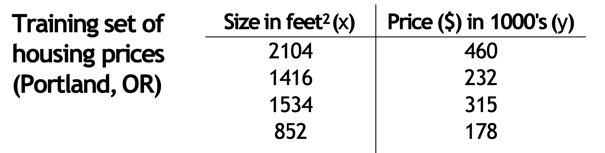
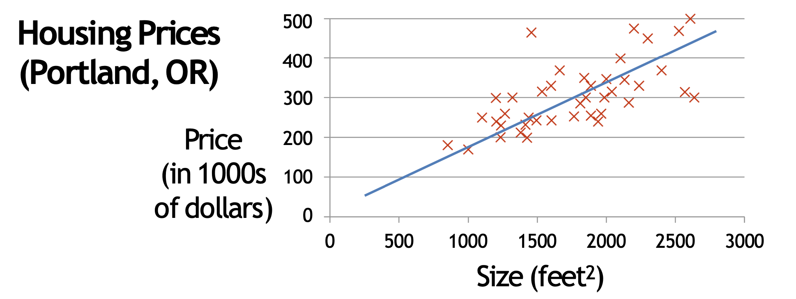
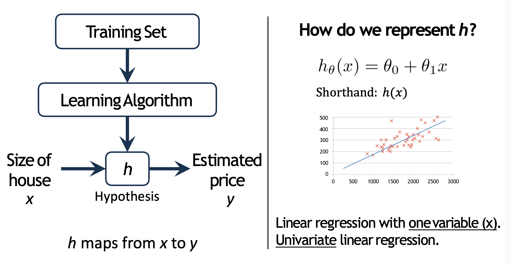
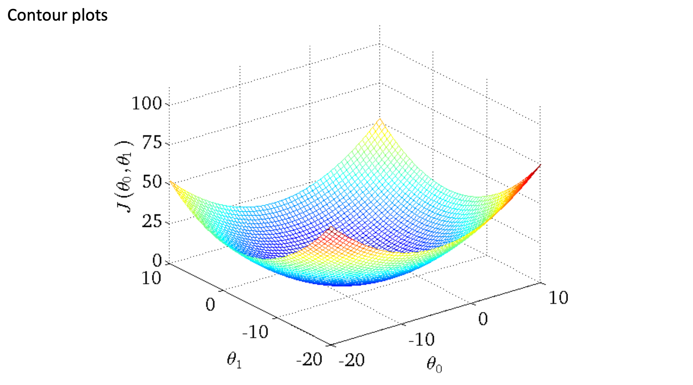
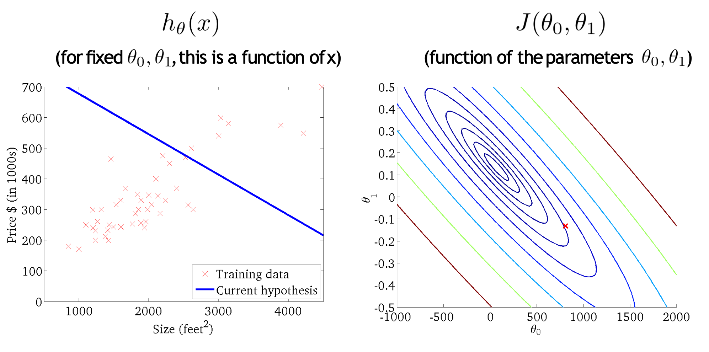
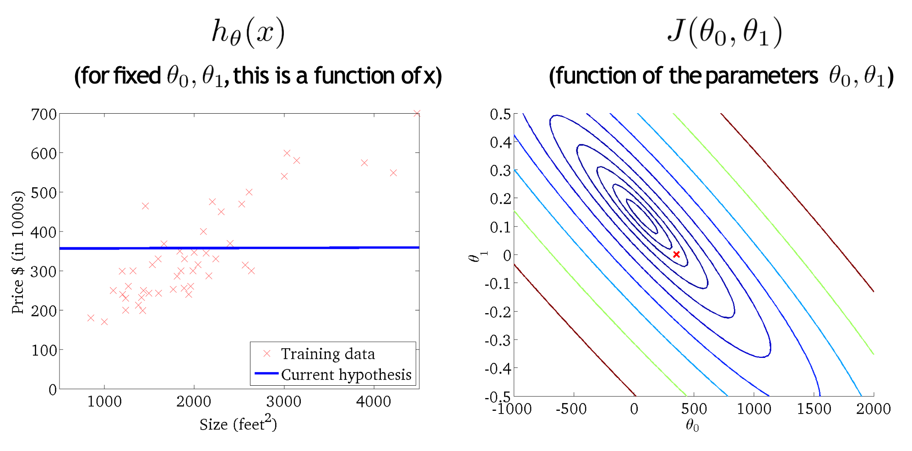
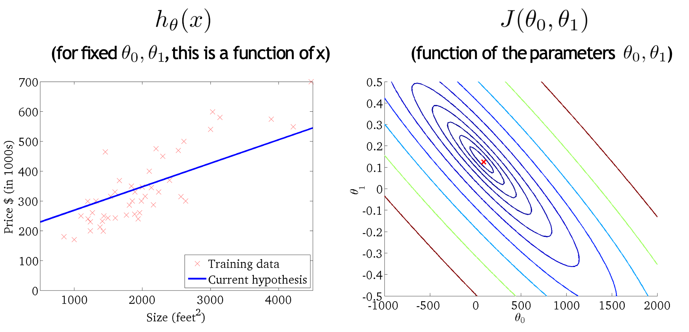
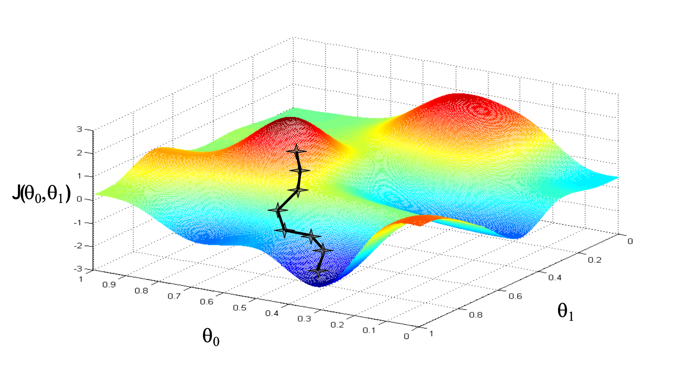
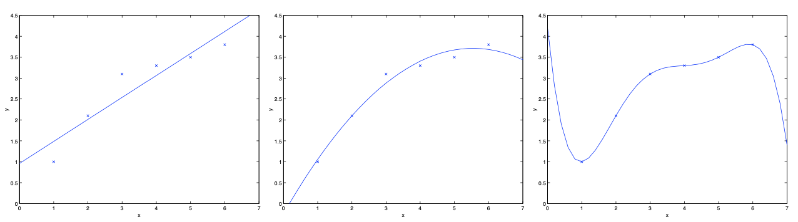

# CS229: Chapter1

- Linear Regression
- Lecture 2~3

## Study Members
- Huisu Lee (Lecture Note Summary)
    - Ajou University, Software and Computer Engineering
    - Computer Vision, Deep Learning

- Dogyu Lee (Code Implementation)
    - Seoul National University, Electrical and Computer Engineering
    - Deep Learning Hardware Acceleration, Optimization

## Contents
- Model Representation
- Linear Regression
- Gradient Descent
- Normal Equation
- Probabilistic Interpretation
- Locally Weighted Linear Regression

## Model Representation

먼저 아래와 같이 Size가 주어졌을 때 Price를 맞추는 Task가 있다고 하자.

    

- Supervised Learning: 데이터의 각 샘플에 대해 올바른 정답이 주어진 경우
- Regression: Real-valued output을 예측하는 경우
- Classification: Discrete-valued output을 예측하는 경우

    

- 이 경우는 Supervised Learning에 해당하며 Regression Task이다.

이제 이러한 Task에 대하여 ML 모델이 어떻게 표현되는지에 대해 생각해보자.

    

- Learning Algorithm: Hypothesis를 결정하고, 이를 확정하는 방법
- Hypothesis: Training set에 대해 Prediction을 생성하는 함수

즉, 데이터셋에 대한 적절한 Learning Algorithm을 선택하여 결정된 Hypothesis는 입력 $x$에 대한 Prediction $y$를 생성하게 된다.

## Linear Regression

### Hypothesis

Linear Regrssion는 아래와 같은 Hypothesis를 갖는다.

$$
h(x)=\sum_{j=0}^{n}\theta_jx_j,~x_0=1
$$

이때, $\theta$의 경우 $n$ 차원의 Parameter이며 $x$는 $n$차원의 Feature이다.

$$
\theta = \begin{pmatrix}
\theta_0 \\
\theta_1 \\
\vdots \\
\theta_n
\end{pmatrix}, ~ x = \begin{pmatrix}
x_0 \\
x_1 \\
\vdots \\
x_n
\end{pmatrix}
$$

행렬을 이용하여 위의 Hypothesis를 간소히 표현하면 다음과 같다.

$$
h(x) = \theta^Tx
$$

### Learning Algorithm

Hypothesis를 확정하기 위해 다음의 Cost Function $J(\theta)$를 정의한다.

$$
J(\theta)=\frac{1}{2}\sum_{i=1}^{m}\left(h_{\theta}(x^i)-y^i\right)^2
$$

$\frac{1}{2}$는 미분시 연산을 간소화하기 위한 상수이며 학습과정에서 아래와 같이 $J(\theta)$를 최소화 하는 $\theta$를 구함으로써 Hypothesis를 확정한다.

$$
\underset{\theta}{\text{argmax}}~J(\theta)
$$

### cf. Terms

- $n$: $x$와 $\theta$의 차원 수
- $m$: 데이터셋의 샘플 개수 $\rightarrow$ $\{(x^i, y^i)\}_{i=1}^{m}$

## Gradient Descent
### Motivation

이제는 어떻게 $J(\theta)$를 최소화할 지가 논의해야 할 문제이다. Gradient Descent를 이에 대한 방법론이다.

먼저 직관적인 이해를 위해 2차원의 $J(\theta)$를 plot하여 얻어진 다음의 그림을 보자.

    

 

또한 이러한 $J(\theta)$와 $h(x)$의 관계를 다음의 그림을 통해 살펴보자.

    

 

    

 

    

 

즉, $J(\theta)$가 줄어들수록 적합한 $h(x)$로 근접함을 알 수 있다.

### Least Mean Squares (LMS update rule)

아래의 그림과 같이 임의의 $\theta$에서 시작해서 $J(\theta)$가 줄어드는 방향으로 $\theta$를 조절하는 것이 Gradient Descent의 핵심이다.

    

 

Gradient Descent의 Update rule은 다음과 같다.

$$
\theta_j := \theta_j - \alpha\frac{\partial}{\partial\theta_j}J(\theta)
$$

이때, $\alpha$는 Learning rate를 의미하고, $\frac{\partial}{\partial\theta_j}J(\theta)$는 $\theta_j$에 대한 편미분을 의미한다. 편미분은 아래와 같이 계산된다.

$$
\begin{align*}
\frac{\partial}{\partial\theta_j}J(\theta) &= \frac{\partial}{\partial\theta_j}\frac{1}{2}\left(h_\theta(x)-y\right)^2\\
&=2 \cdot \frac{1}{2}\left(h_\theta(x)-y\right) \frac{\partial}{\partial\theta_j}\left(h_\theta(x)-y\right)\\
&= \left(h_\theta(x)-y\right)\cdot\frac{\partial}{\partial\theta_j}\left(\sum_{i=1}^{n}\theta_ix_i-y \right) \\
&=\left(h_\theta(x)-y\right)x_j^i
\end{align*}
$$

이에 따라 최종적인 Update rule은 다음과 같이 정리할 수 있다.

$$
\theta_j := \theta_j +\alpha(y^i-h_{\theta}(x^i))x_j^i
$$

이때, $i$는 데이터 sample의 index이다.

### Batch Gradient Descent VS Stochastic Gradient Descent

> `실질적으로는 Batch size를 정하는 것과 관련된 개념`

Batch Gradient Descent의 경우 하나의 epoch에서 전체 sample에 대해 기울기를 파악하여 단 한번의 Update만 수행하는 기법이다.

$$
\theta_j := \theta_j +\alpha\sum_{i=1}^{m}\left(y^i-h_{\theta}(x^i)\right)x_j^i~~~(\text{for every}~j)
$$

- 매 Update(epoch)마다 배치 전체 샘플에 대한 기울기를 고려하여 더 안정적인 학습 가능
- Global Optimum에 도달하기 쉬움
- 매 Update마다 배치 전체 샘플을 계산하여 수렴속도가 느리고, 계산량이 많음
- 모든 데이터를 메모리에 올려야 하므로 메모리 사용량이 큼

$\therefore~$ 작은 데이터셋이나 학습 안정성이 중요할 때 사용

Stochastic Gradient Descent의 경우 epoch 내의 각 iteration 마다 해당 index sample에 대해 기울기를 파악하여 총 $m$번 Update를 수행하는 기법이다.

$$
\theta_j := \theta_j +\alpha\left(y^i-h_{\theta}(x^i)\right)x_j^i~~~(\text{for every}~j)
$$

- 매 Update(sample)마다 하나의 샘플만 고려하므로 빠른 업데이트 가능, 계산량이 적음
- 하나의 샘플만 사용하기에 메모리 사용량이 적음
- 최적점 근처에서도 수렴이 불안정할 수 있음 (Oscillation)
- 진동으로 인해 최종 수렴이 지연될 수 있음

$\therefore~$ 대규모 데이터셋이나 실시간 학습에 사용

## Normal Equation

Normal Equation은 Linear regression에서 $J$를 최소화하는 optimal parameter $\theta$를 직접적으로 찾는 방법이다.

먼저 Normal Equation을 다루기 전에 Matrix derivatives에 대해 정리하자.

### Matrix derivatives

$n\times d$ 의 행렬 $A$ 를 입력받아 실수 값을 출력하는 함수 $f:\mathbb{R}^{n\times d}\rightarrow\mathbb{R}$가 있다고 하자. 이때, $A$에 관하여 $f$의 미분은 다음과 같이 정의된다.

$$
\nabla_Af(A) = \begin{bmatrix}
\frac{\partial f}{\partial A_{11}} & \cdots & \frac{\partial f}{\partial A_{1d}} \\
\vdots & \ddots & \vdots \\
\frac{\partial f}{\partial A_{n1}} & \cdots & \frac{\partial f}{\partial A_{nd}}
\end{bmatrix}
$$

예를 들어 $2\times 2$ 행렬 $A$와 함수 $f:\mathbb{R}^{2\times 2} \rightarrow \mathbb{R}$가 다음과 같이 정의되었다고 하자.

$$
A = \begin{bmatrix}
A_{11} & A_{12}\\
A_{21} & A_{22}\\
\end{bmatrix},~
f(A)=\frac{3}{2}A_{11}+5A_{12}^{2}+A_{21}A_{22}
$$

이때, $\nabla_Af(A)$는 아래와 같이 계산된다.

$$
\nabla_Af(A) = \begin{bmatrix}
\frac{3}{2} & 10A_{12}\\
A_{22} & A_{21}\\
\end{bmatrix}
$$

### Least squares revisited and Normal Equation

이제 행렬 미분을 통해 $J(\theta)$를 최소화하는 optimal $\theta$를 찾아보자.

먼저 $m$개의 training set에 대해 design matrix $X$를 다음과 같이 정의하자.

$$
X = \begin{bmatrix}
(x^1)^T\\
(x^2)^T\\
\vdots\\
(x^m)^T
\end{bmatrix}
$$

또한 $m$개의 target values를 가진 벡터 $\vec{y}$를 다음과 같이 정의하자.

$$
\vec{y} = \begin{bmatrix}
y^1\\
y^2\\
\vdots\\
y^m
\end{bmatrix}
$$

이제 $h_{\theta}(x^i)=(x^i)^T\theta$에서 다음을 얻을 수 있다.

$$
\begin{align*}
X\theta-\vec{y} &= \begin{bmatrix}
(x^1)^T\theta\\
(x^2)^T\theta\\
\vdots\\
(x^m)^T\theta
\end{bmatrix} - \begin{bmatrix}
y^1\\
y^2\\
\vdots\\
y^m
\end{bmatrix}\\
&= \begin{bmatrix}
h_{\theta}(x^1) - y^1\\
h_{\theta}(x^2) - y^2\\
\vdots\\
h_{\theta}(x^m)- y^m
\end{bmatrix}
\end{align*}
$$

이때, $z^Tz = \sum_{i}z_i^2$에 따라 다음을 얻을 수 있다.

$$
\begin{align*}
J(\theta) &=\frac{1}{2}\sum_{i=1}^m(h_{\theta}(x^i)-y^i)^2\\
&= \frac{1}{2}(X\theta-\vec{y})^T(X\theta-\vec{y})
\end{align*}
$$

마지막으로 다음의 사실과 함께 주어진 식을 $\theta$에 대해 미분하자.
- 3번째 줄: $a^Tb=b^Ta$
- 5번째 줄 (1): $\nabla_xb^Tx=b$
- 5번째 줄 (2): 대칭행렬 $A$에 대해 $\nabla x^TAx=2Ax$

$$
\begin{align*}
\nabla_{\theta}J(\theta) &= \nabla_{\theta}\frac{1}{2}(X\theta-\vec{y})^T(X\theta-\vec{y})\\
&=\frac{1}{2}\nabla_{\theta}\left((X\theta)^TX\theta-(X\theta)^T\vec{y}-\vec{y}^T(X\theta)+\vec{y}^T\vec{y} \right) \\
&=\frac{1}{2}\nabla_{\theta}\left(\theta^T(X^TX)\theta-\vec{y}^T(X\theta)-\vec{y}^T(X\theta) \right)\\
&=\frac{1}{2}\nabla_{\theta}\left(\theta^T(X^TX)\theta-2(X^T\vec{y})^T\theta \right)\\
&=\left(2X^TX\theta-2X^T\vec{y} \right)\\
&=X^TX\theta-X^T\vec{y}
\end{align*}
$$

$J(\theta)$를 최소화하기 위해 미분한 식이 $0$이 되는 $\theta$를 찾기 위해 다음의 Normal Equation을 얻는다.

$$
X^TX\theta = X^T\vec{y}
$$

이제 위의 Normal Equation을 정리하여 $J(\theta)$를 최소화하는 $\theta$를 구할 수 있다.

$$
\theta = (X^TX)^{-1}X^T\vec{y}
$$

## Probabilistic Interpretation

Probabilistic Interpretation은 cost fucntion $J(\theta)$를 다음과 같이 정의하는 것에 대한 확률적 해석을 다룬다.

$$
J(\theta)=\frac{1}{2}\sum_{i=1}^{m}\left(h_{\theta}(x^i)-y^i\right)^2
$$

먼저 Linear Regression에서는 Target variables $y$ 와 inputs $x$가 다음의 수식을 따르는 관계를 가짐을 가정한다.

$$
y^i = \theta^{T}x^i + \epsilon^i
$$

$\epsilon^i$는 오차항 (error term)으로 모델링되지 않은 효과나 노이즈를 capture한다. 이때, 이러한 $\epsilon^i$는 독립적이고, 동일한 정규분포 (independently and identically distributed, **IID**)를 따르고, 평균이 $0$이고, 분산이 $\sigma^2$인 Gaussian Distribution을 따른다고 가정한다.

즉, 위의 가정에 따라 $\epsilon^i$의 확률 밀도 함수 $p(\epsilon^i)$는 다음과 같다.

$$
p(\epsilon^i) = \frac{1}{\sqrt{2\pi}\sigma}\exp\left(-\frac{(\epsilon^i)^2}{2\sigma^2}\right)
$$

두 가정을 종합하여 $\theta$가 결정될 때마다 $x$에 대한 $y$의 확률분포는 조건부 확률분포를 따르며 이를 나타내는 $p(y^i\mid x^i;\theta)$는 다음과 같이 정의된다.

$$
p(y^i\mid x^i;\theta) = \frac{1}{\sqrt{2\pi}\sigma}\exp\left(-\frac{(y^i-\theta^{T}x^i)^2}{2\sigma^2}\right)
$$

### cf. $p(y\mid x, \theta)$ vs $p(y\mid x;\theta)$

- $p(y\mid x, \theta)$: $x$와 $\theta$에 대한 $y$의 확률 분포를 의미한다. 이때, $\theta$ 또한 변수가 되는 것이다.
- $p(y\mid x;\theta)$: $\theta$가 결정될 때마다 $x$에 대한 $y$의 확률 분포를 의미한다. 이때, $\theta$는 함수 내부에서 상수 취급한다.

- 우리는 Linear Regression에서 $\theta$가 결정될 때마다 $x$와 $y$의 관계를 살피고 있다는 점에 주목하자. 즉, $\theta$는 함수의 변수로써 취급되는 것이 아니라 parameterized된 상수로써 인식 되어야 한다.

### Likelihood

지금 우리는 $\theta$가 결정될 때마다 $x$에 대한 $y$의 확률 분포를 가정에 따라 알고 있다. 이에 따라 전체 데이터셋에 대한 사건이 일어날 확률를 구할 수 있고, 역으로 이를 $\theta$에 대해 관찰하여 전체 데이터셋에 대한 사건이 일어날 확률를 최대화하는 $\theta$를 찾고자 한다.

이를 위해 가능도 (Likelihood)를 $\theta$에 대해 다음과 같이 정의한다.

$$
\begin{align*}
x_1, x_2, \ldots, x_m = X,~ y_1, y_2, \ldots,y_m = \vec{y}\\
~\\
L(\theta) = L(\theta; X, \vec{y}) = p(\vec{y}\mid X;\theta)
\end{align*}
$$

이후 위에서 가정한 **IID**에 따라 수식을 다음과 같이 전개할 수 있다.

$$
\begin{align*}
L(\theta; X, \vec{y}) &= p(\vec{y}\mid X;\theta)\\
&=p(y^1\mid x^1;\theta)\times\cdots\times p(y^m\mid x^m;\theta)\\
&=\prod_{i=1}^mp(y^i\mid x^i;\theta)\\
&=\prod_{i=1}^m\frac{1}{\sqrt{2\pi}\sigma}\exp\left(-\frac{(y^i-\theta^{T}x^i)^2}{2\sigma^2}\right)
\end{align*}
$$

### Log likelihood & Maximum Likelihood Estimation (MLE)

이제 우리는 해당 Likelihood $L(\theta)$가 최대가 되도록 하는 $\theta$를 찾고자 한다. 이때, 계산상의 편의를 위해 log likelihood $\ell(\theta)$를 정의하여 최대가 되도록 하는 $\theta$는 동일하지만, 미분을 간략하게 하는 전략을 취할 수 있다.

$$
\begin{align*}
\ell(\theta) &= \log L(\theta)\\
&= \log \prod_{i=1}^m\frac{1}{\sqrt{2\pi}\sigma}\exp\left(-\frac{(y^i-\theta^{T}x^i)^2}{2\sigma^2}\right) \\
&=\sum_{i=1}^m\log\prod_{i=1}^m\frac{1}{\sqrt{2\pi}\sigma}\exp\left(-\frac{(y^i-\theta^{T}x^i)^2}{2\sigma^2}\right)\\
&= m\log\frac{1}{\sqrt{2\pi}\sigma} - \frac{1}{\sigma^2}\cdot\frac{1}{2}\sum_{i=1}^{m}\left(y^i-\theta^{T}x^i\right)^2
\end{align*}
$$

결론적으로 cost fuction $J(\theta)$는 다음과 같이 유도된다.

$$
\begin{align*}
\hat{\theta}(x_1, \ldots, x_m) &=\underset{\theta}{\text{argmax}}~ L(\theta)\\
&=\underset{\theta}{\text{argmax}}~ \ell(\theta)\\
&=\underset{\theta}{\text{argmax}}~ -\frac{1}{2}\sum_{i=1}^{m}\left(y^i-\theta^{T}x^i\right)^2\\
&=\underset{\theta}{\text{argmin}}~ \frac{1}{2}\sum_{i=1}^{m}\left(y^i-\theta^{T}x^i\right)^2\\
&=\underset{\theta}{\text{argmin}}~ J(\theta)
\end{align*}
$$

### cf. Metric

Metric은 모델이 얼마나 좋은 성능을 내는지 평가하기 위한 수치적 기준을 의미한다.

- MAE: Mean Absolute Error
    - 데이터의 단위와 동일하여 직관적 해석 가능
    - 이상치에 대해 덜 민감

$$
\text{MAE} = \frac{1}{n}\sum_{i=1}^n\mid y_i-\hat{y_i}\mid 
$$
- MSE: Mean Squared Error
    - 회귀모델의 오차가 가우시안 분포를 따른다고 가정하면 MSE를 최소화하는 것은 MLE를 수행하는 것과 동일
    - 연속적이고, 미분가능한 함수로 최적화 기법 계산 시 유리
    - 큰 오차에 대해 더 큰 페널티 부여 (이상치에 민감)

$$
\text{MSE} = \frac{1}{n}\sum_{i=1}^{n}\left(y_i-\hat{y}_i\right)^2
$$

- RMSE: Root Mean Squared Error
    - 실제 데이터와 동일한 단위로 MSE에 Root를 취한 것
    - 데이터의 단위와 동일하여 직관적 해석 가능

$$
\text{RMSE} = \sqrt{\frac{1}{n}\sum_{i=1}^{n}\left(y_i-\hat{y}_i\right)^2}
$$

- RSE: Residual Standard Error
    - 모델의 복잡도 $p$를 고려하여 과적합을 방지
    - RSE는 Residual의 표준 편차를 의미하며 오차의 분산을 추정 가능

$$
\text{RMSE} = \sqrt{\frac{1}{n-p-1}\sum_{i=1}^{n}\left(y_i-\hat{y}_i\right)^2}
$$

## Locally Weighted Linear Regression (LWR)

### Motivation

$x \in \mathbb{R}$로부터, $y$를 예측하는 문제를 고려하자.

    

 

좌측 그림의 경우 $y=\theta_0+\theta_1x$로 fitting한 결과이며, 중앙의 경우 $x^2$ feature를 추가하여 $y=\theta_0+\theta_1x+\theta_2x^2$으로 fitting한 결과이다. 우측의 경우 $y=\sum_{j=0}^{5}\theta_jx^j$로 fitting한 결과이다.

처음에는 더 많은 feature를 추가하면 모델이 더 좋아질 것처럼 보일 수도 있으나, 너무 많은 특징을 추가하면 오히려 문제가 발생할 수도 있다. 예를 들어, 우측의 경우 학습된 곡선은 모든 데이터 포인트를 완벽하게 통과하지만, 이 곡선이 새로운 데이터에 대해 좋은 예측을 할 것이라 기대하기 어렵다.

- 왼쪽 그림(과소적합, Underfitting):
    - 모델이 너무 단순하여 데이터의 패턴을 제대로 학습하지 못하는 경우.
    - 데이터가 특정 구조를 가지고 있음에도 불구하고, 모델이 이를 포착하지 못함.
- 오른쪽 그림(과적합, Overfitting):
    - 모델이 너무 복잡하여 훈련 데이터에 지나치게 맞춰진 경우.
    - 새로운 데이터를 예측할 때 일반화 성능이 떨어질 가능성이 큼.

위의 예시에서 볼 수 있듯이 feature 선택은 학습 알고리즘의 성능을 결정하는 중요한 요소이다. 이때, Locally Weighted Linear Regression (LWR)은  충분한 양의 훈련 데이터가 주어진다면, 특정한 feature의 선택이 덜 중요해질 수 있도록 하는 기법이다.

### Method

LWR은 특정 $x$와 가까운 sample에 집중하여 Linear Regression을 수행하는 방법을 말한다.

즉, $\theta$에 대해 cost function $j(\theta)$를 다음과 같이 정의한다.

$$
J(\theta)=\frac{1}{2}\sum_{i=1}^{m}w^i\left(y^i-\theta^Tx^i\right)^2
$$

이때, $w^i$는 다음의 함수로 정의되며, 가우시안 분포의 유사한 형태의 함수이다.

$$
w^i = \exp\left(-\frac{(x^i-x)^2}{2\tau^2}\right)
$$

즉, 특정 $x$를 지정하여 $x$와의 거리에 따라 다른 가중치가 부여된다. 이때, $\tau$는 Bandwidth Parameter가 되며 다음의 성질을 갖는다.

- $\tau$의 값이 큼: 넓은 범위의 데이터에 가중치 부여 $\rightarrow$ Global 모델
- $\tau$의 값이 작음: 좁은 범위의 데이터에 가중치 부여 $\rightarrow$ Local 모델

또한 $x^i$에 따라 다음의 성질을 갖는다.

- $x^i$가 $x$에 근접:  $w^i \approx 1$ $\rightarrow$ 높은 가중치를 가짐.
- $x^i$가 $x$에서 멀어짐:  $w^i \approx 0$ $\rightarrow$ 무시됨.

### Analysis

- LWR의 방식을 요약하면 다음과 같다.
	1.	특정한 새로운 입력  $x$가 주어짐.
	2.	샘플과의 거리를 계산하여 각 샘플에 가중치  $w^i$  를 부여.
	3.	가중치를 적용한 새로운 로컬 모델을 학습(새로운 $\theta$ 를 구함).
	4.	새롭게 학습된 $\theta$ 로 예측을 수행.

- 특징: LWR은 예측할 때마다 전체 훈련 데이터를 다시 사용하여 새롭게 학습을 수행해야 함.
따라서, 모든 예측 과정에서 훈련 데이터를 저장하고 있어야 하며, 계산량이 많음.
- Non-Parametric 모델
    - 기존 선형 회귀는 데이터에 fitting된 고정된 유한한 수의 파라미터 $\theta$를 사용하여 결과를 예측하는 Parametric 모델
    - LWR은 예측할 때마다 새로운  $\theta$를 계산해야 하고, 모델의 복잡도가 훈련 데이터 크기에 따라 증가하므로 Non-Parametric 모델

- Global 모델 vs Local 모델
    - 일반적인 선형 회귀는 하나의 Global 모델을 학습하여 모든 $x$에 대해 동일한 함수 $h(x)$를 사용
    - LWR은 $x$에 대해 Local 모델을 학습하여 예측을 수행함.

- 데이터셋 크기와 계산 비용
    - 기존 선형 회귀는 $\theta$를 한 번 학습한 후, 이를 저장해 놓고 예측할 수 있으나, LWR은 예측할 때마다 전체 데이터셋을 고려해야 하므로 계산 비용이 크다. $\rightarrow$ 훈련 데이터셋이 커질수록 예측 시간이 오래 걸림.