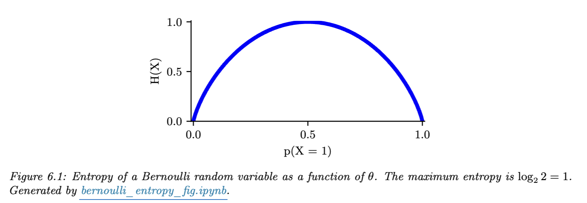

# Information Theory

## Entropy

확률 분포의 엔트로피는 주어진 분포에서 추출된 확률 변수와 관련된 불확실성 또는 예측 불가능성의 척도로 해석될 수 있다. 

$ X_n \sim p $를 생성하는 분포 $ p $를 관찰한다고 가정하자. 

- $p$의 엔트로피가 높은 경우: $X_n$의 값을 예측하기 어려움
    - $D=(X_1,\ldots,x_n)\rightarrow$ high information
- $p$의 엔트로피가 낮은 경우 (0에 근접): $X_n$의 값을 예측하기 쉬움 (모든 $X_n$이 동일해짐)
    - $D=(X_1,\ldots,x_n)\rightarrow$ Low information

### Entropy for discrete random variables

$K$개의 상태에 대한 분포 $ p $를 가진 이산 확률 변수 $ X $의 엔트로피 $H(X)$는 다음의 수식을 따라 정의된다.

$$
H(X) \triangleq -\sum_{k=1}^{K} p(X = k) \log_2 p(X = k) = -E_X[\log p(X)]
$$

예를 들어, $ X \in \{1, \ldots, 5\} $이고 히스토그램 분포가 $ p = [0.25, 0.25, 0.2, 0.15, 0.15] $인 경우, $ H = 2.29 $ 비트가 된다.

최대 엔트로피를 가진 discrete distribution은 uniform distribution 이다. $K$개의 상태를 가진 분포에서 엔트로피는 $ p(x = k) = \frac{1}{K} $일 때 최대가 된다. 이 경우 다음과 같이 $ H(X) = \log_2 K $가 성립한다.

$$
H(X) = -\sum_{k=1}^{K} \frac{1}{K} \log \left(\frac{1}{K}\right) = -\log\left(\frac{1}{K}\right) = \log(K)
$$

대조적으로, 최소 엔트로피(0인 경우)를 가지는 분포는 모든 질량을 한 상태에 부여하는 델타 함수이다. 이러한 분포는 불확실성이 없다.

### Binary Entropy function

이진 랜덤 변수의 특별한 경우, $X \in \{0, 1\}$에 대해 $p(X = 1) = \theta$와 $p(X = 0) = 1 - \theta$로 쓸 수 있다. 따라서 엔트로피는 다음과 같이 표현된다.

$$
\begin{align*}
H (X) &= -[p(X = 1) \log_2 p(X = 1) + p(X = 0) \log_2 p(X = 0)] \\
&= -[\theta \log_2 \theta + (1 - \theta) \log_2(1 - \theta)]
\end{align*}
$$

이는 이진 엔트로피 함수라고 하며, $H (\theta)$로도 쓸 수 있다. 분포가 균일할 때, 즉 $\theta = 0.5$일 때 1 비트의 최대값을 얻는다. 예시로 공정한 동전은 상태를 결정하기 위해 하나의 예/아니오 대답만 존재한다. 아래의 그림에서 해당 분포를 확인할 수 있다.

    

 

### Cross Entropy

실제 분포 $p$와 예측 분포 $q$ 간의 교차 엔트로피 $H_{ce}$는 다음과 같이 정의된다.

$$
H_{ce}(p, q) \triangleq -\sum_{k=1}^{K} p_k \log q_k
$$

교차 엔트로피는 실제 분포 $p$에서 추출한 일부 데이터 샘플을 예측 분포 $q$를 기반으로 하여 압축하는 데 필요한 비트 수의 기대값이다. 이는 $q = p$로 설정함으로써 최소화될 수 있으며, 이 경우 최적 코드의 기대 비트 수는 $H_{ce}(p, p) = H(p)$임이 알려져 있다.

실질적으로 모델링을 통하여 구한 분포값인 확률 분포 $q$를 이용하여 실제 확률분포 $p$ 예측한다. 즉, 교차 엔트로피는 두 분포 사이에 존재하는 정보량을 구하는 것이며 Loss로 사용하게 되면, $0$에 가깝도록 값을 줄이도록 학습이 진행되기에 정답에 해당하는 예측값이 $1$에 가까워지도록 학습된다.

### Joint Entropy

엔트로피 설명에 앞서 Joint distribution을 먼저 다뤄보자. Joint distribution은 2개 이상의 사건이 동시에 일어나는 확률 분포를 말한다. 이러한 확률 분포를 수식으로 표현하면 $p(X\cap Y)$ 혹은 $p(X, Y)$ 가 된다. 이때, 실제 확률값은 $p(X=x, Y=y)$ 로 표현될 수 있다.

두 랜덤 변수 $X$와 $Y$의 결합 엔트로피는 다음과 같이 정의된다.

$$
H(X, Y) \triangleq - \sum_{x,y} p(x,y) \log p(x,y)
$$

예를 들어, 다음과 같이 1에서 8까지의 정수를 선택하는 경우를 고려해 보자.

$ n \in \{1, \ldots, 8\} $이고, $X(n),~Y(n)$은 다음의 분포를 따른다.

$$
X(n)=\begin{cases}
1 &~ \rm{if ~ n~ is ~even}\\
0 &~ \rm{otherwise}
\end{cases},~ Y(n) = 
\begin{cases}
1 &~ \rm{if ~ n~ is ~prime}\\
0 &~ \rm{otherwise}
\end{cases}
$$

$$
\begin{array}{c|cccccccc}
n & 1 & 2 & 3 & 4 & 5 & 6 & 7 & 8 \\
\hline
X & 0 & 1 & 0 & 1 & 0 & 1 & 0 & 1 \\
Y & 0 & 1 & 1 & 0 & 1 & 0 & 1 & 0 \\
\end{array}
$$

이때, Joint Distribution은 $p(x, y)=p(y|x)p(x)$에 따라 다음과 같다.

$$
\begin{array}{c|cc}
p(X, Y)& Y = 0 & Y = 1 \\
\hline
\\
X = 0 & \frac{1}{8} & \frac{3}{8} \\
\\
X = 1 & \frac{3}{8} & \frac{1}{8} \\
\end{array}
$$

이에 따라 Joint Entropy는 정의에 따라 다음과 같다.

$$
H(X, Y) = -\left( \frac{1}{8} \log_2 \frac{1}{8} + \frac{3}{8} \log_2 \frac{3}{8} + \frac{3}{8} \log_2 \frac{3}{8} + \frac{1}{8} \log_2 \frac{1}{8} \right) = 1.81 \text{ bits}
$$

여기서 marginal probabilities는 균일하다. 즉, $ p(X = 1) = p(X = 0) = p(Y = 0) = p(Y = 1) = 0.5 $ 이므로 $ H(X) = H(Y) = 1 $ 이다. 따라서 $ H(X, Y) = 1.81 \text{ bits} < H(X) + H(Y) = 2 \text{ bits} $ 이다. 실제로 다음과 같이 Joint Entropy에 대한 상한은 일반적으로 성립한다. 

$$
H(X, Y) \le H(X)+H(Y)
$$
만약 $ X $와 $ Y $가 독립적이라면 $ H(X, Y) = H(X) + H(Y) $이므로 이 경계는 타이트하다. 이는 부분들이 어떤 방식으로 상관관계가 있을 때 시스템의 “자유도”가 감소하고, 따라서 전체 엔트로피가 감소한다는 것으로 직관적 이해가 가능하다.

다음으로 $ H(X, Y) $의 하한을 살펴보자. 만약 $ Y $가 $ X $의 결정론적 함수라면, $ H(X, Y) = H(X) $이고, 반대의 경우는 $H(X, Y)=H(Y)$이다. 이에 따라 다음이 성립한다.

$$
H(X, Y) \geq \max\{H(X), H(Y)\} \geq 0
$$

직관적으로 이는 변수를 결합하는 것이 엔트로피를 줄이지 않는다고 말할 수 있다. 즉, 더 많은 미지수를 문제에 추가함으로써 불확실성을 줄일 수는 없다. 이는 데이터 관찰을 필요로 하는데, 이 주제는 후술할 Conditional Entropy에서 다룬다. 이와 별개로 결합 엔트로피 정의를 명백한 방식으로 두 변수에서 $ n $ 변수로 확장할 수 있다.

### Conditional entropy

$ X $가 주어졌을 때 $ Y $의 조건부 엔트로피는 $ X $를 본 후 $ Y $에 대한 불확실성을 나타내며, 가능한 $ X $ 값에 대한 평균이다. 즉, $X$가 주어졌을 때 $Y$의 엔트로피 기댓값으로 정의되며,  $\mathbb{E}_{p(x)}$는 $X$의 확률 분포 $p(x)$에 대한 기댓값을 나타낸다.

$$
\begin{align*}
H(Y|X) & \triangleq E_{p(X)}[H(p(Y|X))] \\
&= \sum_x p(x) H(p(Y|X = x)) \\
&= -\sum_x p(x) \sum_y p(y|x) \log p(y|x) \\
&= -\sum_{x, y}p(x, y)\log p(y|x) \quad \left(~\because~ p(x, y)=p(y|x)p(x)~\right)\\
&= -\sum_{x, y}p(x, y)\log \frac{p(x, y)}{p(x)}\\
&=-\sum_{x, y}p(x, y)\log p(x, y) + \sum_{x}p(x)\log p(x)\quad \left(~\because~ \sum_{x, y}p(x, y)~\right)\\ 
&= \underbrace{H(X, Y)}_{\text{Joint Entropy}}-H(X)
\end{align*}
$$