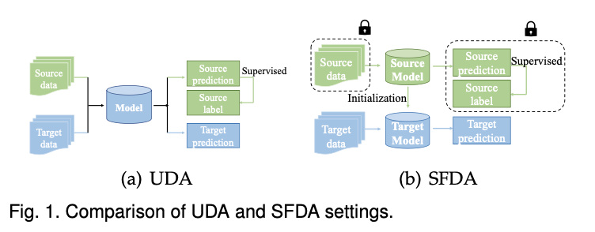

### Notation
***
- $n$: number of instances
- $\mathcal{D}$: Domain
- $\mathcal{X}$: Instance set
- $d$: Feature dimensions
- $\mathcal{F}(x)$: Feature vector
- $\mathcal{Y}|\mathcal{X}$: Prediction for instance $\mathcal{X}$
- $\Phi$: Domain space
- $\mathbf{L}$: Source label set
- $\mathcal{L}$: Loss function
- $\delta$: Soft-max operation
- $c$: Number of classes
- $\tilde{z}$: Noise vector
- $\Theta$: Model parameters
- $\mathcal{F}$: Feature extractor
- $\mathcal{C}$: Classifier
- $\mathcal{D}$: Domain discriminator
- $G$: Generator
- $\mathcal{M}$: Model to be trained
- $\mathbf{M}$: Module
- $\mathcal{B}$: Memory bank
- $\mu$: Means
- $\sigma$: Standard deviation
- $\mathbb{E}$: Mathematical expectation
- $P$: Marginal distribution
- $Q$: Query
- $K$: Key
- $V$: Value
- $\mathcal{N}(\mu, \sigma^2)$: A Gaussian distribution with mean $\mu$ and variance $\sigma^2$

### Math Expression
***
- $\{\}$
- $\not=$
- $\neq$
- $\verb|~|$
- $log$, $\rm{log}$, $\log$
- $\pi$
- $\sum_{k=1}^{K}$
- $\cap$
- $\cup$
- $\times$
- $\mathbf{K}$
- $\rightarrow$
- $\cdot$
- $\ldots$
- $\forall$
- $\text{and}$
- $\left\{\|\right\}$
- $\circ$
- $\in$
- $\not\in$
- $a \mid b$
- $a \nmid b$ 
- $a \equiv b$
- $a \not\equiv b$
- $\pm$
- $\mp$
- $\nabla$
- 알파: $\Alpha, \alpha$
- 베타: $\Beta, \beta$
- 감마: $\Gamma, \gamma$
- 델타: $\Delta, \delta$
- 입실론: $\Epsilon, \epsilon$
- 제타: $\Zeta, \zeta$
- 에타: $\Eta, \eta$
- 쎄타: $\Theta, \theta$
- 람다: $\Lambda, \lambda$
- 뮤: $\Mu, \mu$
- 파이: $\Pi, \pi$
- 로우: $\Rho, \rho$
- 시그마: $\Sigma, \sigma$
- 타우: $\Tau, \tau$
- 오메가: $\Omega, \omega$

### 특수 표기
***
$$
\prod_{j\in\mathbb{C}_i} p_{ij} \tag{1}
$$
$$
\min_{\theta_{\mathcal{F}}, \theta_{c_1}, \theta_{c_2}} \sum_{i=1}^{2} \mathcal{L}_{\text{cls}}\left( C_i\left( \mathcal{F}\left( \mathcal{X}^s \right) \right), \mathcal{Y}^s \right)
\tag{2}
$$
$$
\begin{cases}
\overrightarrow{\varepsilon}\left( \mathcal{D}^t, \mathcal{D}^I \right)_{UDA} &= \overrightarrow{\varepsilon}(\mathcal{D}^t, \mathcal{D}^s) + \overrightarrow{\varepsilon}(\mathcal{D}^s, \mathcal{D}^I) \\
\overrightarrow{\varepsilon}\left( \mathcal{D}^t, \mathcal{D}^I \right)_{SFDA} &= \overrightarrow{\varepsilon}(\mathcal{D}^{t+}, \mathcal{D}^t)
\end{cases}
\tag{3}
$$
$$
F = \begin{bmatrix}
F_{1,1} & \cdots & F_{1,n_w} \\
\vdots & \ddots & \vdots \\
F_{n_h,1} & \cdots & F_{n_h,n_w}
\end{bmatrix}
\tag{4}
$$
$$
\begin{align}
221 &= 35 \cdot 6 + 11 \\
35 &= 3 \cdot 11 + 2 \\
11 &= 5 \cdot 2 + 1 \\
2 &= 2 \cdot 1 + 0 \\
\end{align}
\tag{5}
$$
$$
\tilde{y}^i =
\begin{cases}
\hat{y}_t^i, & \text{if} \ p_t^i \geq \tau \\
\text{mode}(y^{1i}, y^{2i},\ldots, y^{Mi}), & \text{if} \  p_t^i < \tau
\end{cases}
\tag{6}
$$
$$
\begin{pmatrix}
1 & 2 & 3\\
a & b & c
\end{pmatrix}
\tag{7}
$$

### Table
***

    <table style="border: 1px solid black; border-collapse: collapse; text-align: center;">
        <tr>
            <th style="border: 1px solid black; padding: 5px;">ICode (16-23)</th>
            <th style="border: 1px solid black; padding: 5px;">Unused (12-15)</th>
            <th style="border: 1px solid black; padding: 5px;">Mask (8-11)</th>
            <th style="border: 1px solid black; padding: 5px;">CC (6-7)</th>
            <th style="border: 1px solid black; padding: 5px;">id (2-5)</th>
            <th style="border: 1px solid black; padding: 5px;">State (1)</th>
            <th style="border: 1px solid black; padding: 5px;">Mode (0)</th>
        </tr>
    </table>

### Figure
***

    

### Text
***

 TEXT TEST 

<ul align="left", style="font-size:16px; font-weight:;">
    <li>첫 번째 항목</li>
    <ul>
        <li>첫 번째 항목의 하위 항목</li>
        <ul>
            <li>첫 번째 항목의 하위 항목의 하위 항목</li>
        </ul>
        <li>두 번째 하위 항목</li>
    </ul>
    <li>두 번째 항목</li>
</ul>
<ul align="center", style="font-size:16px; font-weight:;">
    첫 줄 
    둘째 줄 
    셋째 줄
</ul>