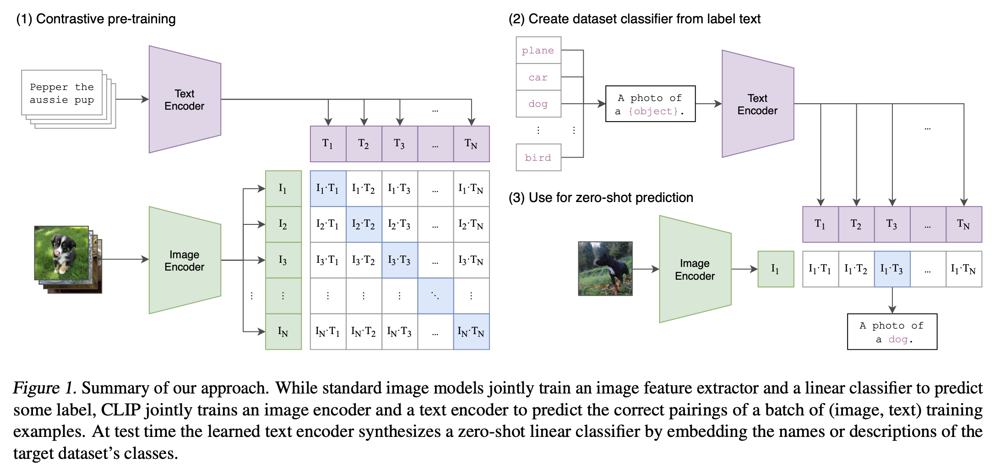
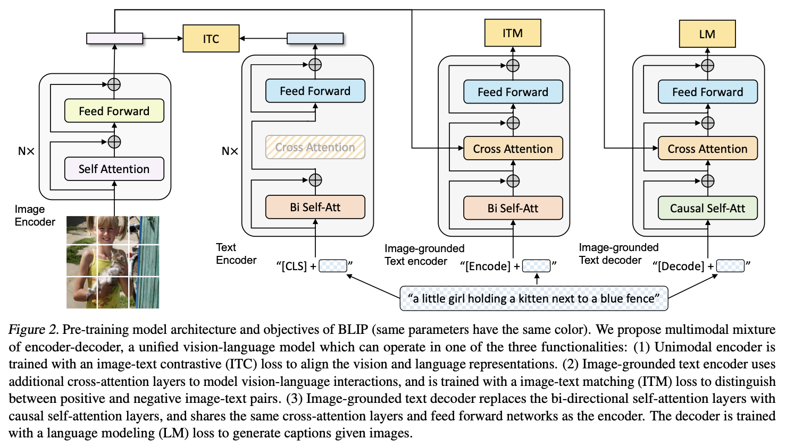
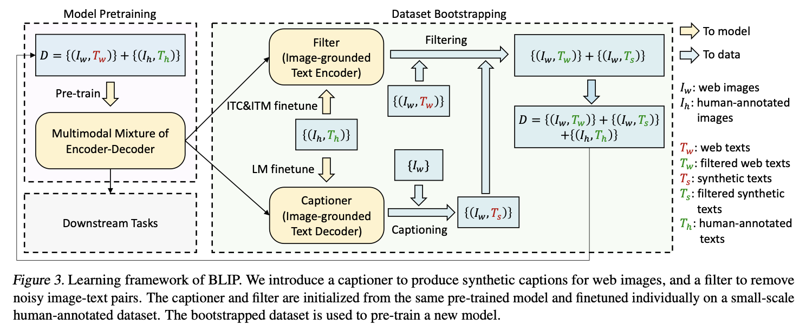

# CLIP(Contrastive Language-Image Pre-Training): Learning Transferable Visual Models From Natural Language Supervision

[ Feb 2021, Alec Radford, Jong Wook Kim, Chris Hallacy, Aditya Ramesh, Gabriel Goh, Sandhini Agarwal, Girish Sastry, Amanda Askell, Pamela Mishkin, Jack Clark, Gretchen Krueger, Ilya Sutskever ]

논문링크: https://paperswithcode.com/paper/learning-transferable-visual-models-from

    

 

# BLIP: Bootstrapping Language-Image Pre-training for Unified Vision-Language Understanding and Generation

[ Jan 2022, Junnan Li, Dongxu Li, Caiming Xiong, Steven Hoi ]

논문링크: https://paperswithcode.com/paper/blip-bootstrapping-language-image-pre

    

 

    

 