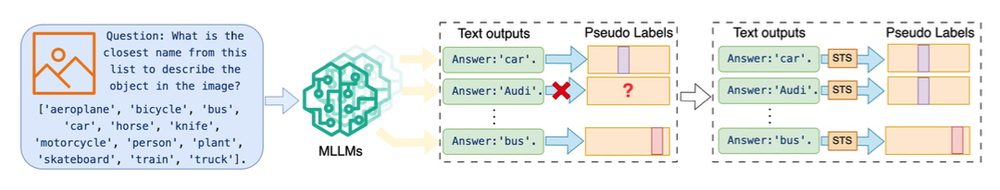
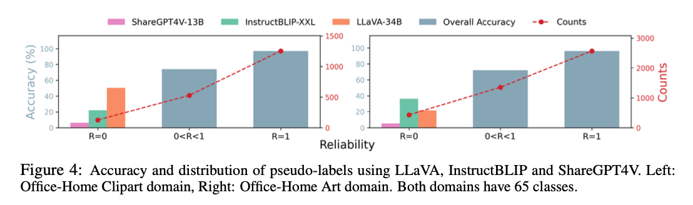
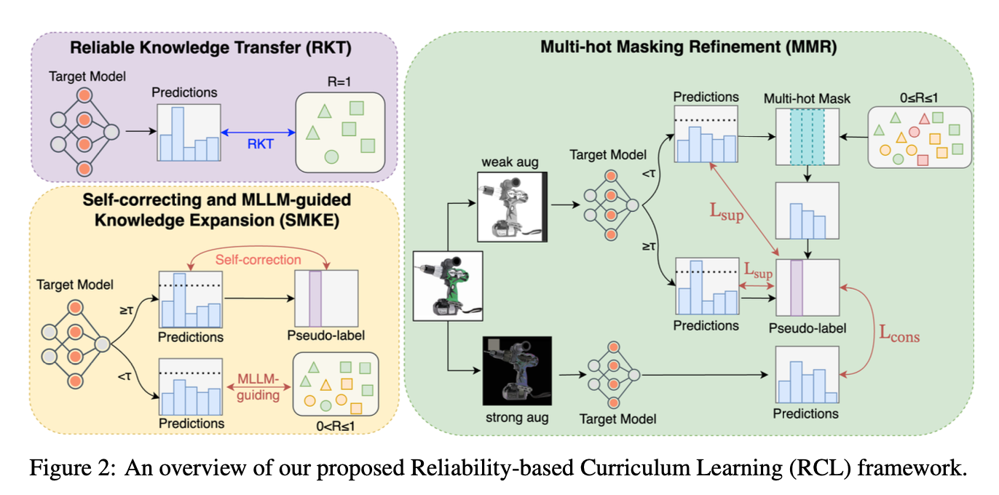
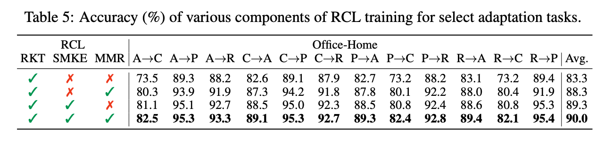
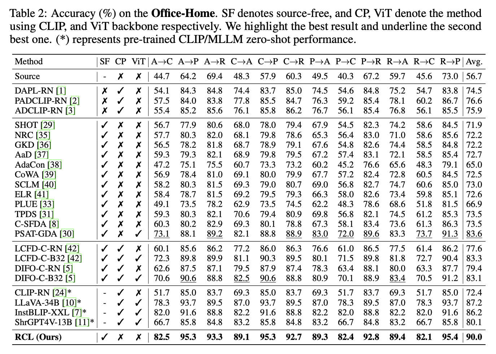

# Empowering Source-Free Domain Adaptation with MLLM-driven Curriculum Learning (RCL)

[ May 2024, Dongjie Chen, Kartik Patwari, Zhengfeng Lai, Sen-ching Cheung, Chen-Nee Chuah ]

논문링크: https://paperswithcode.com/paper/empowering-source-free-domain-adaptation-with

## 1. Introduction

- Source-Free Domain Adaptation(SFDA)는 레이블이 없는 타겟 도메인의 데이터만 사용해 사전 학습된 소스 모델을 적응시키는 기법
- 기존 SFDA 방법들은 소스 모델의 지식을 제대로 활용하지 못하고, 타겟 도메인 데이터를 효과적으로 사용하지 못하는 문제를 가지고 있음
- 이 논문은 Multimodal Large Language Models(MLLMs)의 잠재력을 활용해 Reliability-based Curriculum Learning (RCL) 프레임워크를 제안
- MLLM 기반의 의사 레이블링을 통해 타겟 도메인 데이터를 점진적으로 활용하고, 적응 성능을 개선하는 것이 목표

## 2. Methodology
### 1. Pseudo-Labeling with MLLMs

    

 

- MLLMs를 이용해서 타겟 이미지에 대한 Pseudo-label을 생성한다.
    - MLLM에게 다중 선택형 질문을 제시하여, 각 이미지에 대해 가장 적합한 클래스를 선택하도록 한다.
    - ex: LLaVA, GPT 등의 MLLM에게 이미지를 입력하고 출력을 받는다.
- Semantic Textual Similarity (STS)에 기반하여 텍스트 유사도를 계산한다.
    - 가장 유사한 클래스의 이름을 의사 레이블로 사용한다.
### 2. Consensus-Based Reliability Measurement

    

 

- 신뢰도 특정: 여러 MLLM에서 생성된 pseudo-label 간의 일치 비율을 계산한다.
    - 모든 MLLM이 일치하는 신뢰도가 높고, 일치하지 않을수록 신뢰도가 낮다.
    - 신뢰도는 각 샘플에 대한 pseudo-label을 일치 비율로 계산된다.

$$

R(x_{t}^{i}) = \frac{1}{M(M-1)} \sum_{m=1}^{M} \sum_{n=1,n \neq m}^{M} \mathbb{1}(\hat{y}^{mi} = \hat{y}^{ni}) 
$$

- 데이터셋 분할: 위에서 측정한 신뢰도에 따라 타겟 도메인의 데이터를 세 그룹으로 나눈다.
    - DR: 모든 MLLM이 일치하는 신뢰도가 가장 높은 데이터
    - DLR: 일부 MLLM이 일치하는 신뢰도가 낮은 데이터
    - DUR: 모든 MLLM이 일치하지 않은 신뢰도가 가장 낮은 데이터
### 3. Reliability-Based Curriculum Learning Framework

    

 

- Reliable Knowledge Transfer (RKT): 
    - 여러 MLLM에서 생성된 레이블 중 신뢰성이 높은 데이터(DR)를 사용해 모델을 학습하는 단계
    - 교차 엔트로피 손실을 사용하여 모델을 훈련한다.
    - 아래 수식에서 $|\mathcal{D}_R|$은 DR의 샘플 개수를 의미한다.

$$
L_{\text{RKT}} = -\frac{1}{|\mathcal{D}_R|} \sum_{(x_r^i, y_r^i) \in \mathcal{D}_R} y_r^i \cdot \log f_{\theta_{t}}(x_r^i)
$$

- Self-correcting and MLLM-guided Knowledge Expansion (SMKE): 
    - 신뢰도가 낮은 데이터(DLR)를 포함하여 학습하는 단게
    - 타겟 모델의 confidence가 높으면 모델 자체의 예측을 사용하고, confidence가 낮으면 MLLM의 의사 레이블을 사용한다.
    - 임계값 $\tau$를 사용하여 타겟 모델의 신뢰도에 따라 학습 방식을 결정한다.

$$
\tilde{y}^i =
\begin{cases}
\hat{y}_t^i, & \text{if} \ p_t^i \geq \tau \\
\text{mode}(y^{1i}, y^{2i},\ldots, y^{Mi}), & \text{if} \  p_t^i < \tau
\end{cases}
\tag{1}
$$

$$
L_{\text{SMKE}} = -\frac{1}{|\mathcal{D}_R \cup \mathcal{D}_{LR}|} \sum_{x_t^i \in \{\mathcal{D}_R \cup \mathcal{D}_{LR}\}} \tilde{y}^i \cdot \log f_{\theta_{t}}(x_t^i) \tag{2}
$$

- Multi-hot Masking Refinement (MMR): 
    - 신뢰성이 가장 낮은 데이터(DUR)까지도 활용하는 단계
    - Multi-hot Masking: 
        - 의사 레이블 중 일부를 마스킹하여 가능한 클래스만 남겨두는 기법
        - 여러 MLLM에서 제공된 의사 레이블이 불확실할 때, 가능성이 높은 클래스를 남기고 나머지 클래스는 학습 과정에서 무시
    - Detail:
        - $\mathbf{z}_{t}^{i} \in \mathbb{R}^{C}$를 타겟 샘플 $x_t^t$에 대한 타겟모델의 예측 확률벡터라 하자.
        - $p_t^i = \max_{c}\mathbf{z}_{t}^{i}$을 통해 confidence score를 얻을 수 있다.
        - $\mathbf{m}^i = 1 - \prod_{m=1}^{M}(1 - 1(y_m^i))$에 기반하여 마스킹 생성 $\mathbf{m}^i \in \{0, 1\}^C$
        - 이 마스킹은 MLLM들이 예측한 클래스에 해당하는 원-핫 벡터를 서로 곱하여 여러 MLLM이 일치하는 클래스는 남기고 나머지는 마스킹한다.
    - 모델의 신뢰도가 높은 때는 모델의 원래의 예측값 중 가장 높은 예측을 사용하고,
    - 모델의 신뢰도가 낮은 경우, 마스킹 벡터를 사용하여 가능성이 적은 클래스를 제외한 클래스 중 가장 높은 것을 선택한다.
    - 마지막으로 consistency loss를 적용하여 약한 증강과 강한 증강 간의 일관성을 유지.
        - $\mathbf{H}$는 교차 엔트로피 손실을 의미한다.

$$
\tilde{y}^i =
\begin{cases}
\argmax(z_t^i), & \text{if} \ p_t^i \geq \tau \\
\argmax(z_t^i \odot m_i), & \text{if} \  p_t^i < \tau
\end{cases}
\tag{1}
$$

$$
L_{\text{sup}} = - \frac{1}{|D_R \cup D_{LR} \cup D_{UR}|} \sum_{x_t^i \in \{D_R \cup D_{LR} \cup D_{UR}\}} \tilde{y}^i \cdot \log f_{\theta_t}(x_t^i) \tag{2}
$$

$$
L_{\text{cons}} = \frac{1}{M} \sum_{m=1}^{M} \sum_{i=1}^{N_t} \mathbf{H}(\tilde{y}^i, \mathbf{z}_{\text{st}}^i) \tag{3}
$$

$$
L_{\text{MMR}} = L_{\text{sup}} + \lambda_{\text{cons}} L_{\text{cons}} \tag{4}
$$

## 3. Experiments

    

 

- MLLM 의사 레이블을 활용한 커리큘럼 학습은 높은 성과를 보였으며, MLLM 자체 성능을 능가

    

 

- RCL은 Office-Home dataset에서 기존 방법 대비 큰 성과를 보임 (83.6% -> 90.0%)

## 4. Conclusion

- RCL은 MLLM의 사전 학습된 지식을 효과적으로 활용하면서도, 타겟 도메인에 점진적으로 적응한다. 
- 소스 데이터를 사용하지 않고도 높은 도메인 적응 성능을 달성하는 방법이다.
- MLLM을 활용한 신뢰성 기반 커리큘럼 학습을 통해 SFDA 성능을 크게 향상시킴. 
- RCL 프레임워크는 MLLM에서 얻은 의사 레이블의 신뢰성을 평가하고, 점진적인 학습을 통해 타겟 도메인 적응력을 강화