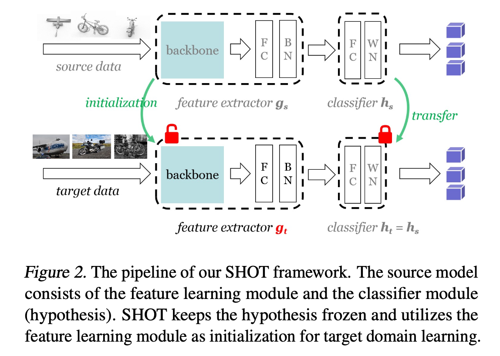
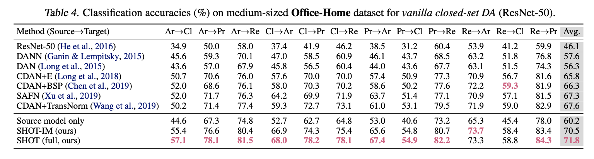

# Source Hypothesis Transfer for Unsupervised Domain Adaptation (SHOT)

Do We Really Need to Access the Source Data? Source Hypothesis Transfer for Unsupervised Domain Adaptation [ ICML 2020, Jian Liang, Dapeng Hu, Jiashi Feng ]

논문링크: https://paperswithcode.com/paper/do-we-really-need-to-access-the-source-data

## 1. Introduction

- Unsupervised Domain Adaptation(UDA)는 레이블이 없는 새로운 도메인에서 소스 데이터셋을 활용하여 비슷한 작업을 수행하는 방법을 연구. 
- 그러나 기존의 UDA 방법들은 소스 데이터에 접근이 필요하여, 개인정보 보호 및 효율성 측면에서 문제가 있음. 
- 이 논문에서는 소스 데이터를 사용하지 않고, 훈련된 소스 모델만을 사용하여 UDA 문제를 해결하는 Source Hypothesis Transfer (SHOT) 방법을 제안. 
- SHOT은 소스 모델의 분류기 모듈(가설)을 고정하고, 타겟 도메인에 맞는 특징 추출 모듈을 학습.

## 2. Methodology

    

 

### 1. Source Model Generation 
- 소스 데이터로 모델을 훈련하여 소스 분류기(hypothesis)를 얻는다.
- 소스 데이터셋 $\mathcal{D}_s$를 사용해서 소스 모델 $f_s = h_s \circ g_s$를 학습한다.
- 이때 손실함수는 아래와 같이 정의된다.
    - $q_k$: 샘플의 정답 레이블 $y_s$에 대한 원핫 인코딩 벡토
    - $\delta_k(f_s(x_s))$: 소스 모델이 샘플 $x_s$에 대해 클래스 $k$로 예측할 확률

$$
L_{\text{src}}(f_s; \mathcal{X}_s, \mathcal{Y}_s) = - \mathbb{E}{(x_s, y_s) \in \mathcal{X}_s \times \mathcal{Y}_s} \sum_{k=1}^{K} q_k \log \delta_k(f_s(x_s))
$$

### 2. Source Hypothesis Transfer with Information Maximization (SHOT-IM)
- 이제 소스 모델의 분류기 모듈 $h_s$를 고정하고, 타겟 모데인에 맞춰 타겟 인코더 $g_t$를 학습시킨다.
- 정보 극대화 손실함수를 이용:
    - 이 손실은 타겟 데이터가 더 확실하게 예측되도록 모델을 유도.
    - 타겟 데이터에 대해 모델의 출력이 특정 클래스에 더 집중되도록 조정.

- 엔트로피 손실: 모델이 더 정확한 예측을 하도록 한다.
    - 모델이 확신 없이 여러 클래스에 고르게 예측을 분포시킬수록 엔트로피는 높아짐.
    - 특정 클래스에 대한 확신이 높을수록 엔트로피는 낮아짐

$$
L_{\text{ent}}(f_t; \mathcal{X}_t) = - \mathbb{E}_{x_t \in \mathcal{X}_t} \sum_{k=1}^{K} \delta_k(f_t(x_t)) \log \delta_k(f_t(x_t)) \tag{1}
$$

- 다양성 손실:  모델이 한 클래스에 집중되지 않고 다양한 클래스를 고르게 예측하도록 한다.
    - 타겟 데이터 $x_t$에 대해 $k$ 클래스의 예측 확률들의 평균 $\hat{p}_k$을 통해 계산
    - 아래의 수식은 배치 내의 예측 클래스 분포가 다양할수록 작아지고, 다양하지 않을수록 커진다
$$
\begin{align*}
L_{\text{div}}(f_t; \mathcal{X}_t) &= \sum_{k=1}^{K} \hat{p}_k \log \hat{p}_k \\
& = D_{KL}(\hat{p}, \frac{1}{K}\mathbb{1}_K)-\log K
\end{align*}\tag{2}
$$

- 타겟 인코터 $g_t$는 아래의 정보 극대화 loss를 통해 학습된다.
$$
L_{\text{IM}} = L_{\text{ent}}(f_t; \mathcal{X}_t) + L_{\text{div}}(f_t; \mathcal{X}_t)
$$

### 3. Source Hypothesis Transfer Augmented with Self-supervised Pseudo-labeling
- 타겟 데이터에 대해 모델이 예측한 레이블을 기반으로 타겟 인코더를 추가적으로 학습한다.
- 각 클래스 별로 타겟 데이터의 클러스터 중심을 계산한다.
    - $c_k^{(0)}$: 클래스 $k$에 대한 클러스터 중심
    - $g_t(x_t)$: 타겟 데이터 $x_t$에 대한 특징 벡터
    - $\delta_k(f_t(x_t))$: 모델이 샘플 $x_t$에 대해 클래스 $k$일 확률
$$
c_k^{(0)} = \frac{\sum_{x_t \in \mathcal{X}_t} \delta_k(f_t(x_t)) g_t(x_t)}{\sum_{x_t \in \mathcal{X}_t} \delta_k(f_t(x_t))}
$$

- 최근접 중심 기반으로 타겟 데이터에 레이블을 할당한다.
    - 이때, $D_f(a,\ b)$는 두 벡터 사이의 코사인 거리를 나타낸다.
    - 각 타겟 샘플 $x_t$는 자신과 가장 가까운 클래스 중심에 해당하는 레이블을 할당 받는다.
$$
\hat{y}_t = \arg \min_k D_f(\hat{g}_t(x_t), c_k^{(0)})
$$

- 의사 레이블을 기반으로 추가적인 학습을 진행한다.

$$
L_{\text{pseudo}}(g_t; \mathcal{X}_t, \hat{\mathcal{Y}}_t) = - \mathbb{E}{(x_t, \hat{y}_t) \in \mathcal{X}_t \times \hat{\mathcal{Y}}_t} \sum_{k=1}^{K} \mathbb{1}_{[k=\hat{y}_t]} \log \delta_k(f_s(x_s))
$$

### 4. Total Loss Function

$$
L(g_t) = L_{\text{ent}}(f_t; \mathcal{X}_t) + L_{\text{div}}(f_t; \mathcal{X}_t) - \beta L_{\text{pseudo}}(g_t; \mathcal{X}_t, \hat{\mathcal{Y}}_t)
$$

## 3. Experiments

    

 
- SHOT 은 Office-Home dataset에서 기존 방법 대비 큰 성과를 보임 (67.6% -> 71.8%)

## 4. Conclusion

- SHOT은 소스 데이터 없이 타겟 도메인에서 적응을 수행할 수 있으며, 다양한 도메인 적응 시나리오(클로즈셋, 오픈셋, 부분셋 등)에 효과적으로 적용된다.
- 정보 극대화와 의사 레이블링을 결합하여 타겟 도메인에 맞는 강력한 특징 표현을 학습한다.
- SHOT은 소스 데이터를 사용하지 않고도 소스 분류기의 가설을 통해 타겟 도메인에 적응하는 새로운 UDA 프레임워크이다. 
- 실험 결과, SHOT은 여러 벤치마크에서 state-of-the-art(2020) 성능을 기록하며, 개인정보 보호와 관련된 문제를 해결하는 데 중요한 기여를 한다.