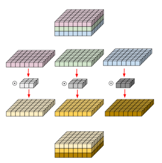

# DeepLabv3+
Encoder-Decoder with Atrous Separable Convolution for Semantic Image Segmentation [ ECCV 2018  ·  Liang-Chieh Chen, Yukun Zhu, George Papandreou, Florian Schroff, Hartwig Adam  ]

https://paperswithcode.com/paper/encoder-decoder-with-atrous-separable

https://kuklife.tistory.com/121

## Abstract
- DeepLab V1: Atrous Convolution을 적용
    - Receptive field를 넓혀서 더 많은 context 정보를 활용하여 segmentation
    - Parameter 수를 유지함으로써 메모리 절약

- DeepLab V2: Atrous Spatial Pyramid Pooling 을 통해 multi-scale의 feature를 학습하여 더 정확한 segmentation을 달성
    - Atrous convolution에서 rate 값을 조절하여 여러 rate의 conv를 통해 multi-scale의 feature를 학습하고, 주변 환경을 고려한 segmentation을 구현

- DeepLab V3: 기존 resnet 구조에 Atrous Convolution을 적용하여 더 깊은 layer를 쌓고, 더 dense한 feature map 형성
    - Max pooling 을 줄이고, Atrous Convolution을 통해 parameter 수는 유지하되, down-scale 되는 정도를 적게 유지함으로써 더 큰 feature map을 구성한다.

- DeepLab V3+: Depthwise Separable Convolution과 Atrous Convolution을 결합한 Atrous Separable Convolution의 활용.
    - 효율적인 파라미터 사용: Depthwise Separable Convolution의 특성 중 하나는 parameter의 효율적인 사용이다. 각 입력 채널에 대해 독립적인 convolution을 수행하고, 이후 atrous convolution을 통해 특성을 결합하기 때문에 파라미터 수가 크게 줄어든다. Atrous Convolution은 컨볼루션 필터 내의 간격을 늘려 넓은 receptive field를 제공하면서도 parameter를 추가하지 않는 장점이 있습니다. Atrous Separable Convolution은 이러한 두 가지 기법을 결합하여 효율적으로 파라미터를 사용하고, 동시에 넓은 receptive field를 제공합니다.
    - 고해상도 특성 맵 유지: Atrous Separable Convolution은 고해상도 특성 맵을 유지하면서도 넓은 receptive field를 제공한다. 이는 세분화 작업과 같은 작업에서 공간적인 정보를 보존하는 데 매우 중요하다. 효율적인 파라미터 사용으로 인해 더 깊은 네트워크를 구성할 수 있으며, 이는 더 복잡한 특징을 학습할 수 있고 더 정확한 세분화 결과를 얻을 수 있다.
    - 메모리 및 연산 비용 절감: Depthwise Separable Convolution과 Atrous Convolution은 각각 메모리 및 연산 비용을 절감하는 효과가 있다. 이를 결합하여 Atrous Separable Convolution은 더 효율적인 네트워크를 구성할 수 있게 한다. 효율적인 네트워크 구조는 더 빠른 학습 및 추론을 가능하게 하고, 제한된 리소스를 보유한 장치에서도 성능을 향상시킬 수 있다.

## Architecture

    

- Atous Separable Convolution 사용
    - 더 넓은 receptive field (더 많은 context)
    - parameter 수의 감소 (메모리 및 연산비용 감소)
    - 더 큰 feature map 유지 (공간 정보 보존)

- ASPP 사용
    - multi-scale feature를 학습 (주변 환경 효과적으로 고려: 작은 object와 큰 object에 모두 robust)

- Encoder-Decoder 구조를 사용
    - upsampling 과정에서 손실된 정보를 고려하여 upsampling
    - U-Net과 유사하게 intermediate connection을 사용

## Atrous Convolution

    

- 필터의 내부 parameter를 0으로 고정하여 비우는 기법
- 더 넓은 receptive field (더 많은 context)
- parameter 수의 감소 (메모리 및 연산비용 감소)
- 더 큰 feature map 유지 (공간 정보 보존)
- Pooling 대신에 Convolution을 통해 feature map의 크기를 줄여감

## Atrous Spatial Pyramid Pooling (ASPP)

    

- Atrous Spatial Pyramid Pooling
    - multi-scale의 feature를 학습하여 더 정확한 segmentation을 달성
    - rate 값의 조절을 통해 multi-scale의 feature를 학습하고 결합하여 주변 환경을 고려한 segmentation 가능

## Depthwise Separable Convolution

    

- 기존의 convolution 방법

    

- Depthwise convolution
    - input의 channel을 분리하여 각 채널에 하나의 필터를 적용하여 convolution
    - parameter 수를 줄일 수 있다
    - Convolution: $3\times 3\times 3$
    - Depthwise Convolution: $3\times 3$

    

- Depthwise separable convolution
    - Depthwise convolution의 결과에 $1\times 1$ conv 적용
    - 일반적인 conv에 비해 같은 size의 feature map을 더 작은 parameter를 이용하여 형성
    - Convolution: $3\times 3\times 3\times 10 = 270$
    - Depthwise Separable Convolution: $(3\times 3\times 3) + (3\times 10) =57$

## Atrous Depthwise Convolution

    

- Atrous depthwise convolution
    - Depthwise separable convolution과 Atrous convolution을 결합

## Summary
- Atrous depthwise convolution 을 이용하여 receptive field를 넓히고, parameter 수는 줄이고, feature map의 크기는 크게 유지하여 deep하고, 좋은 성능의 모델을 구성했다

- Atrous Spatial Pyramid Pooling 을 통해 multi-scale의 feature를 학습하여 multi-scale segmentation을 가능하게 했다.

- Encoder-Decoder 구조를 가지고 있다.

