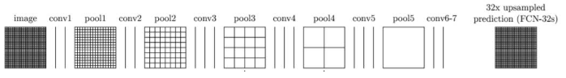

# FCN (Fully Convolutional Network)
Fully Convolutional Networks for Semantic Segmentation [ CVPR 2015  ·  Evan Shelhamer, Jonathan Long, Trevor Darrell ]

https://paperswithcode.com/method/fcn

https://kuklife.tistory.com/117

## Abstract

- 기존의 CNN을 이용한 Classification task에서 Segmentation task로 전환된 모델의 시초

- 기존에는 fully connected layer를 통해 최종분류를 수행한다. 다만, 이럴 경우에 입력 이미지가 1차원 벡터로 변경되어 공간 정보가 제거된다.

- Segmentation에서는 픽셀 단위로 classification을 수행해야 하기에 공간 정보를 유지하는 것이 중요하다.

- FCN에서는 Fully convolutional layer를 통해 공간정보를 유지하도록 하여 segmentation task에 이용되었다. 또한 fully connected layer는 고정된 input size를 요구하는데, Fully convolutional layer에서는 input size가 달라져도 상관없다.

## Architecture

<div style="text-align: center;">
    
</div>

- End-to-End:
    - 입력에서 출력까지의 전체 모델이 단일 모델로 구성되어 있음을 의미한다.
    - 입력데이터에서 최종 목표까지 모든 변환을 하나에 모델에서 처리
    - 전처리 및 중간처리 등의 단계가 없어서 복잡성을 줄일 수 있다.
    - 에시: 자율주행자동차에서 센서데이터를 입력으로 하여 최종데이터인 조향 및 가속도를 바로 출력하는 모델.

- Pixels-to-Pixels:
    - 입력이미지의 모든 픽셀을 출력이미지의 모든 픽셀로 매핑하는 모델을 의미.
    - 입력이미지와 출력이미지의 모든 픽셀 관계를 학습.
    - Segmentation, 영상변환, 이미지 복원 등에 사용될 수 있음.
    - Segmentation에서는 이미지의 입력 픽셀을 해당 클래스에 대한 레이블로 매핑하는 모델을 의미.
    - prediction feature map은 input과 동일한 size를 가져야 한다.
    
- 전체 patch를 사용하는 것이 빠른 수렴이 가능하여 patch를 sampling하기보다는 전체 이미지를 input으로 이용한다.(효율적인 학습)

- Heatmap: class의 score와 spatial information을 담고 있다.
    - convolution 층들을 통과하여 heatmap을 생성하는데, 이 heatmap의 개수는 class개수와 동일한 개수로 생성된다.
    - 즉, heatmap은 각 픽셀별로 해당 class에 해당될 가능성에 대한 정보를 담게 된다.
    - 이 heatmap의 size를 input size로 복원하여 모든 pixels에 대한 class를 예측한다. (dense prediction)
    - 이 과정에서 Upsampling 기법이 적용된다.

- Upsampling: Bilinear interpolation을 통해 Upsampling 과정에서 빈 픽셀을 적절히 채워준다.
    - input 이미지와 동일한 feature map size를 얻게 하기 위함
    - 손실된 spatial information과 data에 대한 충분한 대응이 되지는 않음

- skip combining (skip connection): 손실된 information을 보완하기 위해 maxpooling된 feature map을 upsampling된 feature map과 결합

## Detail

<div style="text-align: center;">
    
</div>

- 위의 사진은 fully connected layer 대신에 fully convolutional layer로 구성된 모델을 나타낸다.

- 이를 통해 spatial information을 최대한 보존한다.

- 각 픽셀은 class에 대한 확률 벡터를 가지게 된다.

<div style="text-align: center;">
    
</div>

- Fully connected layer를 사용했을 때에는 1차원 벡터로 전환되어 위치 정보 손실

<div style="text-align: center;">
    
</div>

- Fully convolutional layer를 사용하여 위치 정보 보존

- $1\times1$ convolution을 적용한 것

<div style="text-align: center;">
    
</div>
 
- Upsampling:
   - bilinear interpolation 기법과 deconvolution 기법이 적용됨(conv의 역 연산)
   - Max Up pooling 등의 기법은 초기에 적용되지 않음
   - upsample stride 8, 16, 32 -> feature map의 정보 하나를 32개로 upsampling 하겠다는 의미를 갖는다.
   - bilinear interpolation 기법과 deconvolution 기법이 적용되었음에도 이미 줄어든 feature map을 통해 추정하는 것이기에 정보손실이 큰 것은 불가피.
   - 이후 논문들은 이러한 기법의 불완전함을 지적하였다.

<div style="text-align: center;">
    
</div>

- skip combining: upsample은 당연히 기존의 정보가 손실된 것을 보완할 수 없기에 이전 layer의 정보를 같이 사용하는 방법을 취한다.

- 이전 layer에서 max pooling에 의해 생성된 feature map과 upsampling을 통해 얻어진 feature map을 pixelwise summation을 하여 prediction map을 생성한다.

## Bilinear Interpolation

- Bilinear interpolation: Bilinear interpolation(양선형 보간)은 두 축에 따른 선형 보간을 결합하여 임의의 위치에서의 값을 추정하는 보간 기법 중 하나이다. 주로 이미지 처리에서 크기 조정 및 회전과 같은 변환 작업에 사용된다. Bilinear interpolation은 먼저 가장 가까운 네 개의 픽셀을 선택하여 각 픽셀의 가중 평균을 계산한다. 이러한 가중 평균은 각 픽셀과 대상 위치 간의 거리에 비례하여 할당된다. 이렇게 하면 원본 이미지의 픽셀 값들 사이의 부드러운 변화를 보존하면서 대상 위치에서의 값을 추정할 수 있다. 간단한 $2\times2$ 그리드를 예를 들어보자. 먼저, 2차원 그리드에서 대상 위치의 좌표를 결정한다. 그런 다음 이 좌표를 기반으로 가장 가까운 네 개의 픽셀을 선택한다. 이 네 개의 픽셀의 값은 각각 거리에 따라 가중 평균이 계산된다. 이렇게 하면 대상 위치에서의 값이 추정된다.

- Bilinear interpolation의 장점:
   - 부드러운 이미지 변환을 제공하여 이미지의 품질을 향상시킨다.
   - 고해상도 이미지를 생성하는 등의 크기 조정 작업에서 효과적으로 사용된다.
   - 계산량이 적고 구현이 간단하여 많은 컴퓨터 비전 및 이미지 처리 응용 프로그램에서 널리 사용된다.

## 1x1 convolution

- 차원 축소(Dimension Reduction):
    - $1\times1$ 합성곱은 입력의 채널 수를 줄이는 데 사용된다. 이를 통해 채널 간의 상관 관계를 감소시키고 계산 비용을 줄일 수 있다. 이러한 차원 축소는 모델의 복잡성을 줄이고, 과적합을 방지하며, 계산 효율성을 향상시킬 수 있다.
- 비선형성(Non-linearity):
    - $1\times1$ 컨볼루션은 비선형성을 도입할 수 있다. 활성화 함수(예: ReLU)를 적용하여 비선형 변환을 수행하므로, 신경망의 표현력을 향상시킬 수 있다.
- 특성 맵 조정(Feature Map Adjustment):
    - $1\times1$ 합성곱을 사용하여 특성 맵의 크기를 조정할 수 있다. 이는 입력 특성 맵의 크기와 출력 특성 맵의 크기를 조절하여 모델의 복잡성을 조절하거나 다른 계층과의 통합을 용이하게 할 수 있다.
- 다양한 연산과 결합:
    - $1\times1$ 합성곱은 다른 연산과 결합하여 다양한 네트워크 아키텍처를 구축하는 데 사용될 수 있다. 예를 들어, Inception 모듈에서 1x1 컨볼루션은 다양한 채널 수를 조절하여 네트워크의 특성을 향상시키는 데 사용된다.


## Performance

<div style="text-align: center;">
    
</div>

- 최종결과는 upsample stride에 따라 위와 같이 생성된다.

- Real-time inference를 충족할 만큼 빠르지 못하다.
    - down sampling과 up sampling 과정에서 많은 parameter로 인해 계산량이 많다.

- Global context information을 무시한다.

- FCN은 입력 이미지를 여러 스케일의 특성 맵으로 다운샘플링하여 세그멘테이션을 수행한다. 이러한 다운샘플링 과정에서 고해상도의 공간적인 정보는 손실될 수 있다. 이는 FCN이 global context information을 무시한다고 말할 수 있는 이유 중 하나이다. 다운샘플링을 거치면서 고해상도의 공간적인 정보가 손실되면, 각 픽셀에 대한 지역적인 정보만을 고려하여 세그멘테이션을 수행하게 된다. 이는 해당 픽셀 주변의 작은 부분 이미지만을 고려하여 클래스를 예측하므로, 해당 픽셀과 관련된 global context(ex: 이미지의 전체적인 구조, 배경/전경 관계 등)을 고려하지 않는다는 것을 의미한다. 따라서 FCN은 전역 맥락 정보를 무시하고 지역적인 정보에만 의존하여 세그멘테이션을 수행하게 된다. 이는 특히 큰 객체가 작은 객체에 의해 잘못 분할되거나 배경과 객체를 구분하기 어려운 경우에 문제가 될 수 있다. 이러한 문제를 해결하기 위해 최근에는 global context information을 고려하는 다양한 네트워크 구조와 기술이 제안되고 있다. 이러한 접근 방식은 입력 이미지의 전역적인 구조와 맥락을 고려하여 세그멘테이션의 정확도를 향상시키는 데 도움이 된다.


## END

- Downsampling(conv & maxpooling): capture semantic & contextual information (특징 추출) 
    - pre-trained model을 이용하여 학습
    - Fully Convolution
    
- Upsampling(deconv & skip connection): maintain spatial information (위치 정보 보존)

## Code

### import
```
import torch
import torch.nn as nn
import torch.nn.functional as F
import torch.optim as optim
from torchvision import datasets, transforms, models
from torchsummary import summary as model_summary
```

### FCN1
```
class FCN(nn.Module):
    def __init__(self):
        super(FCN, self).__init__()
        
        self.block1 = nn.Sequential(
            nn.Conv2d(3, 64, kernel_size=3, padding=1),
            nn.ReLU(),
            nn.Conv2d(64, 64, kernel_size=3, padding=1),
            nn.ReLU(),
            nn.MaxPool2d(kernel_size=2, stride=2)
        )
        self.block2 = nn.Sequential(
            nn.Conv2d(64, 128, kernel_size=3, padding=1),
            nn.ReLU(),
            nn.Conv2d(128, 128, kernel_size=3, padding=1),
            nn.ReLU(),
            nn.MaxPool2d(kernel_size=2, stride=2)
        )
        self.block3 = nn.Sequential(
            nn.Conv2d(128, 256, kernel_size=3, padding=1),
            nn.ReLU(),
            nn.Conv2d(256, 256, kernel_size=3, padding=1),
            nn.ReLU(),
            nn.MaxPool2d(kernel_size=2, stride=2)
        )
        self.block4 = nn.Sequential(
            nn.Conv2d(256, 512, kernel_size=3, padding=1),
            nn.ReLU(),
            nn.Conv2d(512, 512, kernel_size=3, padding=1),
            nn.ReLU(),
            nn.MaxPool2d(kernel_size=2, stride=2)
        )
        self.block5 = nn.Sequential(
            nn.Conv2d(512, 512, kernel_size=3, padding=1),
            nn.ReLU(),
            nn.Conv2d(512, 512, kernel_size=3, padding=1),
            nn.ReLU(),
            nn.MaxPool2d(kernel_size=2, stride=2)
        )
        
        self.relu    = nn.ReLU(inplace=True)
        self.deconv1 = nn.ConvTranspose2d(512, 512, kernel_size=3, stride=2, padding=1, dilation=1, output_padding=1)
        self.bn1     = nn.BatchNorm2d(512)
        self.deconv2 = nn.ConvTranspose2d(512, 256, kernel_size=3, stride=2, padding=1, dilation=1, output_padding=1)
        self.bn2     = nn.BatchNorm2d(256)
        self.deconv3 = nn.ConvTranspose2d(256, 128, kernel_size=3, stride=2, padding=1, dilation=1, output_padding=1)
        self.bn3     = nn.BatchNorm2d(128)
        self.deconv4 = nn.ConvTranspose2d(128, 64, kernel_size=3, stride=2, padding=1, dilation=1, output_padding=1)
        self.bn4     = nn.BatchNorm2d(64)
        self.deconv5 = nn.ConvTranspose2d(64, 32, kernel_size=3, stride=2, padding=1, dilation=1, output_padding=1)
        self.bn5     = nn.BatchNorm2d(32)
        self.classifier = nn.Conv2d(32, 2, kernel_size=1)
        
    def forward(self, x):
        x = self.block1(x)
        x1 = x
        x = self.block2(x)
        x2 = x
        x = self.block3(x)
        x3 = x
        x = self.block4(x)
        x4 = x
        x = self.block5(x)
        x5 = x
        
        score = self.bn1(self.relu(self.deconv1(x5)))     # size=(N, 512, x.H/16, x.W/16)
        score = score + x4                                # element-wise add, size=(N, 512, x.H/16, x.W/16)
        score = self.bn2(self.relu(self.deconv2(score)))  # size=(N, 256, x.H/8, x.W/8)
        score = score + x3                                # element-wise add, size=(N, 256, x.H/8, x.W/8)
        score = self.bn3(self.relu(self.deconv3(score)))  # size=(N, 128, x.H/4, x.W/4)
        score = score + x2                                # element-wise add, size=(N, 128, x.H/4, x.W/4)
        score = self.bn4(self.relu(self.deconv4(score)))  # size=(N, 64, x.H/2, x.W/2)
        score = score + x1                                # element-wise add, size=(N, 64, x.H/2, x.W/2)
        score = self.bn5(self.relu(self.deconv5(score)))  # size=(N, 32, x.H, x.W)
        score = self.classifier(score)                    # size=(N, n_class, x.H/1, x.W/1)
        
        return score

model = FCN()
model_summary(model, (3,224,224), device='cpu')
```

### FCN2

```
ranges = {'vgg16': ((0, 5), (5, 10), (10, 17), (17, 24), (24, 31))}

class VGGNet(nn.Module):
    def __init__(self, pretrained=True):
        super(VGGNet, self).__init__()
        self.ranges = ranges['vgg16']
        self.features = models.vgg16(weights=pretrained).features

    def forward(self, x):
        output = {}
        for idx in range(len(self.ranges)):
            for layer in range(self.ranges[idx][0], self.ranges[idx][1]):
                x = self.features[layer](x)
            output["x%d"%(idx+1)] = x
        return output

    
class FCNs(nn.Module):
    def __init__(self, pretrained_net, n_class):
        super().__init__()
        self.n_class = n_class
        self.pretrained_net = pretrained_net
        self.relu    = nn.ReLU(inplace=True)
        self.deconv1 = nn.ConvTranspose2d(512, 512, kernel_size=3, stride=2, padding=1, dilation=1, output_padding=1)
        self.bn1     = nn.BatchNorm2d(512)
        self.deconv2 = nn.ConvTranspose2d(512, 256, kernel_size=3, stride=2, padding=1, dilation=1, output_padding=1)
        self.bn2     = nn.BatchNorm2d(256)
        self.deconv3 = nn.ConvTranspose2d(256, 128, kernel_size=3, stride=2, padding=1, dilation=1, output_padding=1)
        self.bn3     = nn.BatchNorm2d(128)
        self.deconv4 = nn.ConvTranspose2d(128, 64, kernel_size=3, stride=2, padding=1, dilation=1, output_padding=1)
        self.bn4     = nn.BatchNorm2d(64)
        self.deconv5 = nn.ConvTranspose2d(64, 32, kernel_size=3, stride=2, padding=1, dilation=1, output_padding=1)
        self.bn5     = nn.BatchNorm2d(32)
        self.classifier = nn.Conv2d(32, n_class, kernel_size=1)

    def forward(self, x):
        output = self.pretrained_net(x)
        
        x5 = output['x5']  # size=(N, 512, x.H/32, x.W/32)
        x4 = output['x4']  # size=(N, 512, x.H/16, x.W/16)
        x3 = output['x3']  # size=(N, 256, x.H/8,  x.W/8)
        x2 = output['x2']  # size=(N, 128, x.H/4,  x.W/4)
        x1 = output['x1']  # size=(N, 64, x.H/2,  x.W/2)

        score = self.bn1(self.relu(self.deconv1(x5)))     # size=(N, 512, x.H/16, x.W/16)
        score = score + x4                                # element-wise add, size=(N, 512, x.H/16, x.W/16)
        score = self.bn2(self.relu(self.deconv2(score)))  # size=(N, 256, x.H/8, x.W/8)
        score = score + x3                                # element-wise add, size=(N, 256, x.H/8, x.W/8)
        score = self.bn3(self.relu(self.deconv3(score)))  # size=(N, 128, x.H/4, x.W/4)
        score = score + x2                                # element-wise add, size=(N, 128, x.H/4, x.W/4)
        score = self.bn4(self.relu(self.deconv4(score)))  # size=(N, 64, x.H/2, x.W/2)
        score = score + x1                                # element-wise add, size=(N, 64, x.H/2, x.W/2)
        score = self.bn5(self.relu(self.deconv5(score)))  # size=(N, 32, x.H, x.W)
        score = self.classifier(score)                    # size=(N, n_class, x.H/1, x.W/1)
    
        return score  # size=(N, n_class, x.H/1, x.W/1)
    
vgg16 = VGGNet(pretrained=True)
model = FCNs(vgg16, 2)
model
```