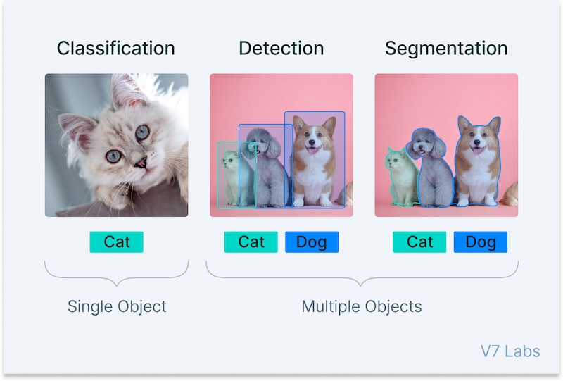
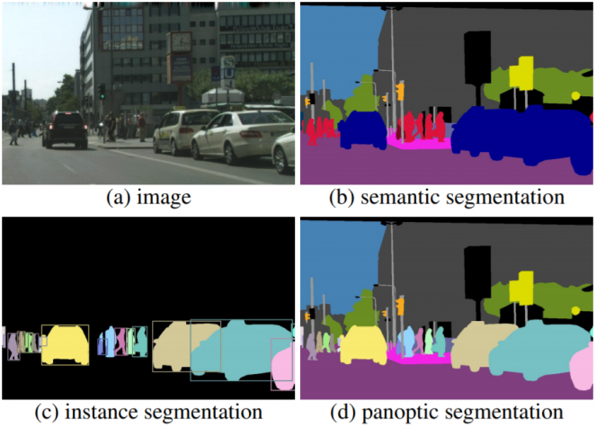
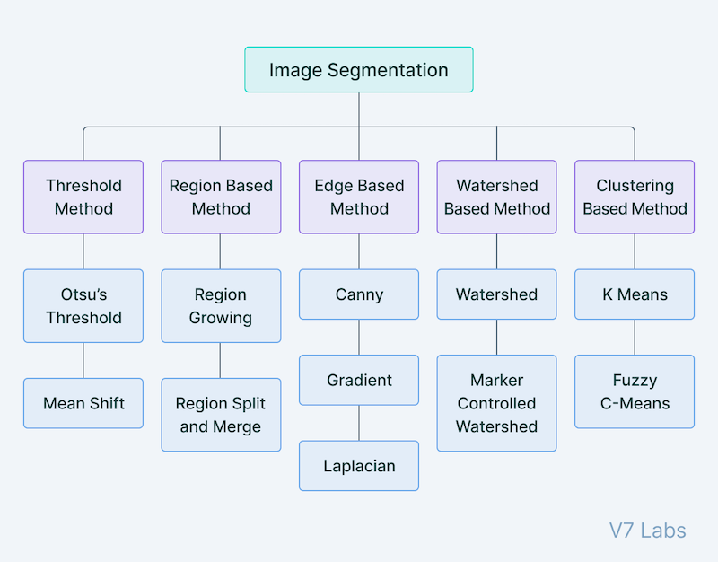
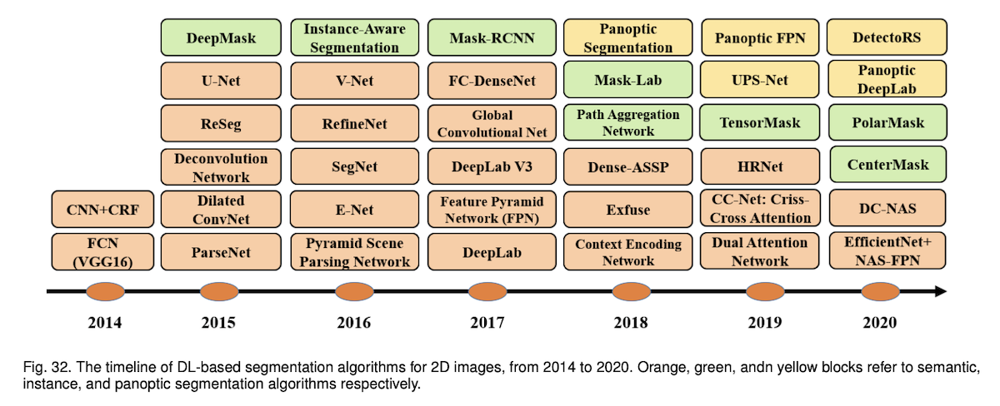

# Introduction of Segmentation
Image Segmentation Using Deep Learning: A Survey [ 2020  ·  Shervin Minaee, Yuri Boykov, Fatih Porikli, Antonio Plaza, Nasser Kehtarnavaz, Demetri Terzopoulos ]

https://paperswithcode.com/paper/image-segmentation-using-deep-learning-a

## 3 Common CV tasks

    
    <figcaption>[1] https://www.v7labs.com/blog/what-is-computer-vision</figcaption>

 

- Classification: Single object에 대해서 object의 class를 구분하는 task.
- Detection: Multiple object에 대해서 각 object의 위치를 bounding box로 찾고, class를 구분하는 task.
- Segmentation: Multiple object에 대해 pixel level에서 classification 하는 task.

## Image Segmentation tasks

    
    <figcaption>[2] https://engineer-mole.tistory.com/273</figcaption>

  

- Semantic Segmentation: 이미지 내에서 각 pixel을 semantic class로 구분
- Instance Segmentation: 이미지 내에서 각 object를 식별하고, pixel level에서 분할 및 구분 (각 객체의 경계를 명확히 구분)
- Panoptic Segmentation: [ Semantic + Instance ]의 방법으로 셀 수 있는 Thing class는 Instance로, 셀 수 없는 Stuff class는 Semantic으로 진행

## Traditional Segmentation method before Deep Learning

    
    <figcaption>[3] https://www.v7labs.com/blog/what-is-computer-vision</figcaption>

 

- DL 이전에는 전통적 ML기법, 수학적 방법, 특징추출 등의 방법을 통하여 Segmentation task를 수행했다.

## Deep Learing based Segmentation

    

 

## 10 Category of DL-based Segmentation

- 1. Fully Convolutional Network: FCN, ParseNet
- 2. Convolutional Models with Graphical Models: CNN+CRF
- 3. Encoder-Decoder Based Models: Deconvolution Network, SegNet, U-Net, V-Net
- 4. Multi-Scale and Pyramid Network Based Models: PSPN
- 5. R-CNN Based Models (for Instance Segmentation): Masked-RCNN
- 6. Dilated Convolutional Models and DeepLab Family: DeepLab
- 7. Recurrent Neural Network Based Models: LSTM
- 8. Attention-Based Models
- 9. Generative Models and Adversarial Training
- 10. CNN Models With Active Contour Models
- 11. Others

## Other Popular Models

- DETER, built for End-to-End object detection with transformer and with slight modifications works well for panoptic segmentation
- FastFCN which uses Joint Pyramid Upsampling(JPU) module to upsample low-resolution feature maps to high-resolution feature maps
- Reverse Attention Network that trains the model to capture the opposite concept (i.e., features that are not associated with a target class) as well
- Pyramid Attention Network that combines attention mechanisms and spatial pyramid pooling mechanism
- Segmentation modules with EfficientNet backbone are now being used widely.

## Segmentation 연구주제

- Deep Network Architecture: 세분화 정확도 개선
- Real-time & Efficient Model: 학습 및 연산 속도, 메모리 효율성 개선
- Data 부족 개선:
    - Semi-Supervised Learning: 일부만 정답 label 존재
    - Weakly Supervised Learning: 불확실한 label (ex: Object Detection label -> Segmentation)
    - Unsupervied Learning: 정답 label 없이 학습
- Domain Adaptation: 일반화 성능 개선 (도메인의 변화에 적응)