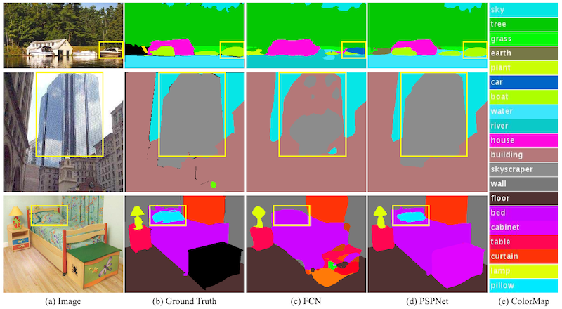
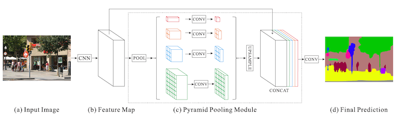
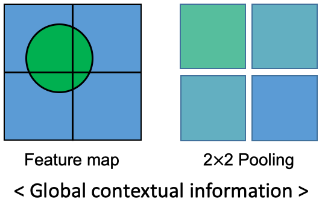

# PSPNet (Pyramid Scene Parsing Network)

Pyramid Scene Parsing Network [ CVPR 2017  ·  Hengshuang Zhao, Jianping Shi, Xiaojuan Qi, Xiaogang Wang, Jiaya Jia ]

https://paperswithcode.com/paper/pyramid-scene-parsing-network

https://mvje.tistory.com/33

https://gaussian37.github.io/vision-segmentation-pspnet/

## Abstract

    

 

- Mismatched Relationship: contextual information과 맞지 않게 오분류
    - ex: 호수 위의 자동차
- Confusion Categories: 헷갈릴 수 있는 픽셀 오분류
    - ex: builing으로 분류된 픽셀 내부에 skyscraper로 오분류 된 경우
- Inconspicuous Classes: 눈에 잘 띄지 않는 물체의 픽셀 오분류. 
    - ex: texture가 비슷한 이불과 베개에서 베개를 분류하지 못하는 경우
- FCN은 이러한 문제점들을 갖고 있었고, PSPNet에서는 Local & Global Context를 모두 고려하여 Segmentation 하고자 하였다.

## Architecture

    

 

    

 

- Pyramid Pooling Module:
    - CNN을 통해 생성된 feature map을 $1\times1,\  2\times2,\  3\times3,\  6\times6$으로 Pyramid pooling 한다.
    - $1\times1$로 pooling된 feature map은 전체 영역에 대한 global context를 담고 있다.
    - $2\times2$의 경우 4분할된 영역에 대해 각각의 global context 를 내포한다. 
    - 여러 size로 pyramid pooling하여 global부터 local까지 여러 context를 고려하게 된다.
    - pooling된 각각의 feature map을 $1\times1$ convolution으로 채널 수가 $1\over 4$이 되도록 한 뒤에 concat 하여 기존 feature map과 채널 수가 동일하도록 맞춰준다.
    - 기존 feature map과 pooling된 feature map을 concat하고, convolution을 통해 prediction을 생성한다.

- $2\times2$의 pooling된 feature map을 생성하는 과정은 먼저 입력 feature map을 4개의 영역으로 나눈다. 나누어진 각각의 영역에 대해 해당 영역에 존재하는 pixel 값들의 평균(Avg Pooling)을 구해서 $2\times2$ 배열에 입력한다. 그러면 위의 그림과 같이 각 pooling pixel에는 sub-region의 전체적인 특징이 나타난다. 이를 통해 contextual information을 모두 고려할 수 있기 때문에 Segmentation에 있어서 더 좋은 성능을 얻을 수 있다.
- 여러 사이즈로 pooling 할수록, max pooling보다는 average pooling을 할 때, convolution으로 dimension을 줄일 때, 성능이 더 좋아진다고 한다.
- Max pooling은 sub-region에서 가장 큰 값을 가져오는 것이기에 하나의 강한 값에 크게 영향을 받는다. 따라서 avg pooling에 비해 context information을 담기에는 적절하지 않다고 해석할 수 있다.

## Performance

- 여러 사이즈로 pooling 할 수록, max 보다는 average pooling을 할 때, conv로 dimension을 줄일 때 성능이 좋아짐
- max pooling은 하나의 강한 값에만 영향을 받기 때문에 context information을 담기에 적절하지 않음
