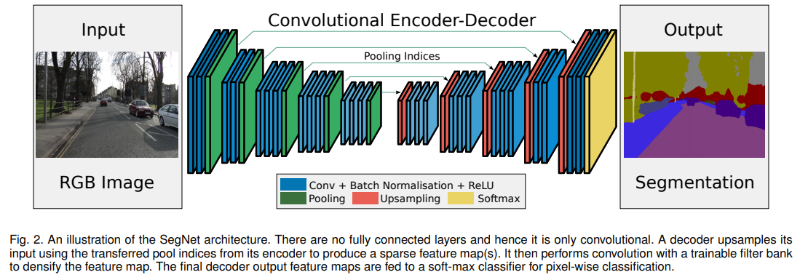
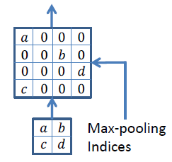

# SegNet
SegNet: A Deep Convolutional Encoder-Decoder Architecture for Image Segmentation [ IEEE 2016 ·  Vijay Badrinarayanan, Alex Kendall, Roberto Cipolla ]

https://paperswithcode.com/paper/segnet-a-deep-convolutional-encoder-decoder

https://kuklife.tistory.com/120

## Abstract

- 목적 자체가 성능을 최대로 보존하는 Real-time segmentation 이다.
- DeConvNet에서 Fully connected layer를 없애서 parameter 수를 줄여 메로리 사용량과 학습시간을 단축하고, Decoder에서 Deconvolution을 실행하지 않아 연산량을 줄인다.
- DeConvNet은 단일 객체 이미지를 입력으로 받지만, SegNet은 복합 객체 이미지를 입력으로 받을 수 있다.

## Architecture

    

 

- Encoder: 
    - VGG16에서 fully connected layer를 제외한 13개의 Conv layer를 사용
    - Max pooling을 할 때, max 값의 index (좌표)를 기억하여 전달

    

 

- Decoder:
    - 전달받은 pooling indices를 통해 Up-pooling 기법으로 Upsampling한다.
    - 마지막에 softmax를 적용하여 각 픽셀별로 확률 벡터를 얻는다.

## Summary

- Encoder-Decoder 구조
- DeConvNet에 비해 단순
    - parameter 수가 적고, 가벼운 모델이다.
    - Fully Connected Layer가 없고, Deconvolution 연산이 없어서 속도가 빠르고, 메모리가 절약.