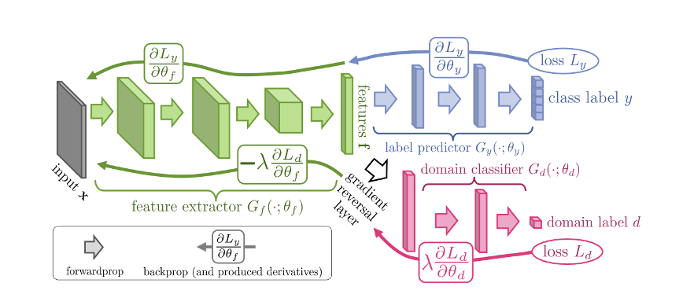
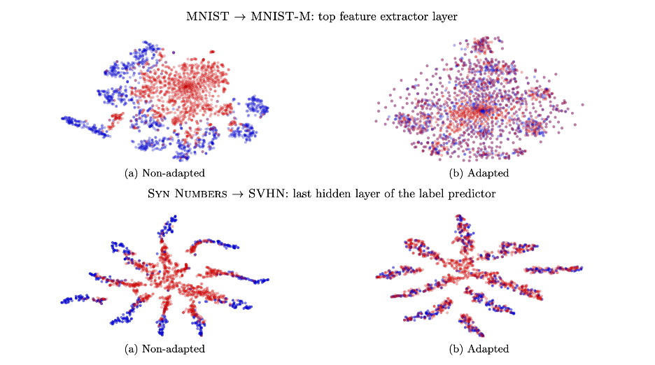

# DANN (Domain Adversarial Neural Network)

[ Domain-Adversarial Training of Neural Networks 2015 , Yaroslav Ganin, Evgeniya Ustinova, Hana Ajakan, Pascal Germain, Hugo Larochelle, François 
Laviolette, Mario Marchand, Victor Lempitsky ]

논문링크: https://paperswithcode.com/paper/domain-adversarial-training-of-neural

## Abstract

- 기본 CNN에서 A라는 데이터셋으로 학습된 모델에 유사하지만 다른 데이터셋인 B 데이터셋을 넣으면, 정확도가 매우 떨어지게 된다. Domain Adaptation이란 Source Domain의 정보를 Target Domain에 전달하여 모델이 Target Domain으로 적응하도록 하는 것을 말하는데, 위의 예시에서는 A의 Domain을 B의 Domain에 적응하도록 하는 것을 말한다.
- DANN의 경우 Domain Adaptation의 시초가 되는 모델이라고 할 수 있다. GAN의 적대적 학습 구조로부터 영감을 얻어 이 개념을 활용하여 DA를 수행하는 모델을 만들었다고 한다.
- Domain Classifier와 Gradient reversal layer가 해당 모델의 핵심적인 구조이며, 이를 통해 어떻게 Domain Adaptation을 수행할 수 있었는지에 대해 정리한다.

## Architecture

    

 

- Input은 Feature extractor에 들어가서 Feature Vector의 형태로 추상화된다.
- 이후 Feature Vector는 Label predictor와 Domain classifier로 전달된다.
- Label predictor에서 산출된 loss는 기존의 CNN과 동일하게 Backpropagation 된다.
- Domain classifier에서 산출된 loss는 Gradient reversal layer에서 음의 상수가 곱해져서 Backpropagation될 때, loss가 증가하는 방향으로 feature extractor에 전달된다.
- 요약하면, feature extractor는 class를 정확히 구분하도록 학습하되, Domain을 잘 구분하지 못하도록 학습한다는 것이 된다.
- DANN은 이러한 adversarial한 방식으로 학습하여 Domain에 불변한 feature를 추출하도록 학습된다.

## Mathematics

### 1. Domain Adaptation
- Unsupervised Domain Adaptation (UDA)는 input space에 해당하는 $X$와 labels에 해당하는 $Y = \{0, 1, \ldots, L-1 \}$로 구성된 classification task이다. 
- $X \times Y$는 2개의 다른 분포를 같는다. 하나는 source domain인 $\mathcal{D}_S$이고 하나는 target domain인 $\mathcal{D}_T$이다.
- UDA에서는 라벨링된 source sample $S$와 라벨링 되지 않은 target sample $T$가 제공되는 것이다.
- $T$의 경우 $\mathcal{D}_T$의 marginal distribution인 $\mathcal{D}_{T}^{X}$로부터 유도된다.

$$
S = \left \{(\mathbf{x}_i, y_i)\right \}_{i=1}^{n} \verb|~| (\mathcal{D}_S)^n;\ \ T=\{\mathbf{x}_i\}_{i=n+1}^N \verb|~| (\mathcal{D}_{T}^{X})^{n'}
$$

- $N = n+n'$이 sample의 총 개수가 된다.
- 학습 알고리즘의 목표는 작은 target risk를 같은 classifier $\eta:X \rightarrow Y$를 구성하는 것이다.

$$
R_{\mathcal{D}_{T}}\left(\eta \right) = \Pr_{(\mathbf{x}, y) \verb|~| \mathcal{D}_{T}} \left(\eta (\mathbf{x}) \neq y \right)
$$
### 2. Domain Divergence
- DA를 위해서 다양한 방법들은 target error의 한도를 정한다. 이 한도는 source error의 합과 source와 target distribution의 distansce를 이용하여 설정된다.
- 이 방법들은 source와 target의 분포가 유사할 때, source risk가 target risk의 좋은 지시자가 될 것이라는 가정하에 직관적으로 정당화된다.
- 도메인 거리를 측정하는 방법 중의 하나로 $\mathcal{H}$-divergence가 이용될 수 있다.
- 수식 (1)에서 hypothesis class $\mathcal{H}$는 set of binary classifiers $\eta : X \rightarrow \{0,1\}$를 의미한다. (모델에 사용되는 함수의 집합으로 이해할 수 있다. 여기서 0은 source, 1은 target으로 간주)
- 두 도메인 분포 $\mathcal{D}_{S}^{X}$, $\mathcal{D}_{T}^{X}$가 주어졌을 때, 두 도메인의 $\mathcal{H}$-divergence는 다음과 같이 정의된다.
    - 모델에 속한 모든 분류기에 대해 다음을 구할 수 있다.
    - 샘플링된 source와 target data에 대해 |source 입력을 타겟으로 예측하는 비율 - target 입력을 타겟으로 예측하는 비율|의 가장 큰 값을 구한다.
    - 모든 분류기에 대해 위의 값 중 가장 큰 값의 2배가 $\mathcal{H}$-divergence가 된다.
    - 즉, 두 도메인을 가장 구분하지 못하는 상태의 거리를 정의하게 된다.
$$
d_{\mathcal{H}}(\mathcal{D}_{S}^{X}, \mathcal{D}_{T}^{X}) = 2 \sup_{\eta \in \mathcal{H}}\left| \Pr_{\mathbf{x} \verb|~| \mathcal{D}_{S}^{X}} [\eta (\mathbf{x})=1] - \Pr_{\mathbf{x} \verb|~| \mathcal{D}_{T}^{X}}  [\eta (\mathbf{x})=1] \right|
$$

- 소스 도메인에서 추출된 $n$개의 샘플 데이터 $S\verb|~|(\mathcal{D}_{S}^{X})^n$와 타겟 도메인에서 추출된 $n'$개의 샘플 데이터 $T~(\mathcal{D}_{T}^{X})^{n'}$ 에 대해 다음을 계산하여 Empirical H-divergence를 구할 수 있다.
    - 모든 분류기에 대해 다음을 구할 수 있다.
    - 샘플링된 소스 데이터들에 대해 샘플을 소스 도메인으로 분류할 비율을 구한다.
    - 샘플링된 타겟 데이터들에 대해 샘플을 타겟 도메인으로 분류할 비율을 구한다.
    - 즉, 1 - "샘플링된 데이터의 도메인을 분류기가 제대로 분류하는 비율의 최솟값" = "샘플링된 데이터의 도메인을 분류기가 잘못 분류하는 비율의 최댓값"의 2배가 Empirical H-divergence가 된다.

$$
\hat{d}_{\mathcal{H}}(S, T) = 2 \left(1-\min_{\eta \in \mathcal{H}}\left[\frac{1}{n}\sum_{i=1}^{n}I[\eta (\mathbf{x}_i)=0]+\frac{1}{n'}\sum_{i=n+1}^{N}I[\eta(\mathbf{x}_i)=1]\right] \right) \tag{1}
$$

$$
I[a] = 
\begin{cases}
1 & ~\text{if}~\text{a is true} \\
0 & ~\text{otherwise}
\end{cases}
$$

### 3. Proxy A-Distance (PAD)
- $\mathcal{H}$-distance는 직접 계산이 어려운 경우가 많다. 따라서 이를 근사하여 구할 수 있다. 
- source는 0, target은 1로 레이블된 데이터셋 $U$를 구성한다.
- 소스 도메인과 타겟 도메인을 구분하는 분류기를 학습시켜 해당 분류기의 오차율 $\epsilon$을 구하여 근사한다.

$$
U = \{(\mathbf{x}_i, 0)\}_{i=1}^{n} \cup \{(\mathbf{x}_i, 1)\}_{i=n+1}^{N} \tag{2}
$$

$$
\hat{d}_{\mathcal{A}} = 2(1-2\epsilon) \tag{3}
$$
### 4. Generalization Bound on the Target Risk
- $R_{\mathcal{D}_T}(\eta)$: 타겟 리스크로 모델 $\eta$가 타겟 도메인에서 잘못 분류할 확률을 의미
- $R_{\mathcal{S}}(\eta)$: 소스 리스크로 모델 $\eta$가 소스 도메인에서 잘못 분류할 확률을 의미
- $\hat{d}_{\mathcal{H}}(S, T)$: $\mathcal{H}$-distance의 근사값 (두 도메인이 다를수록 값이 크다.)
- $\sqrt{\frac{4}{n}\left(d\log \frac{2en}{d}+\log \frac{4}{\delta}\right)}$: 복잡도 항으로 $\mathcal{H}$의 차원이 클수록 (모델이 복잡할수록) 값이 커지고, 샘플 수가 많아질수록 작아진다.
- $\beta$: 타겟 도메인과 소스 도메인에서 모두 잘 작동하는 분류기가 존재할 때의 위험. 이 값이 작을수록 두 도메인에서 모두 잘 작동하는 분류기가 존재함을 의미.

$$
R_{\mathcal{D}_T}(\eta) \leq R_{\mathcal{S}}(\eta) + \sqrt{\frac{4}{n}\left(d\log \frac{2en}{d}+\log \frac{4}{\delta}\right)} + \hat{d}_{\mathcal{H}}(S, T) + \sqrt{\frac{4}{n}\left(d\log \frac{2n}{d}+\log \frac{4}{\delta}\right)} + \beta, \\
with \ \ \beta \geq \inf_{\eta^{*} \in \mathcal{H}}[R_{\mathcal{D}_S}(\eta^{*}) + R_{\mathcal{D}_T}(\eta^{*})], \ and \ R_{S}(\eta) = \frac{1}{n} \sum_{i=1}^{m}I[\eta (\mathbf{x}_i) \neq y_i]
$$

- 소스 도메인에서의 성능이 좋아야 하며, 동시에 소스와 타겟 도메인의 차이(H-divergence)가 작아야 타겟 도메인에서의 성능도 좋다.
- 즉, 두 도메인을 구분하기 어려운(즉, H-divergence를 작게 만드는) 특성 공간으로 데이터를 변환하는 것이 중요하다.

### 5. Domain Adversarial Neural Network (DANN)

#### Neural Network (NN)

- $X = \mathbb{R}^m$: input space (m-dimensional)
- $G_f$: hidden layer
- $\{G_f: X \rightarrow \mathbb{R}^D\}$: 새로운 $D$-dimension으로 mapping 됨
- $(\mathbf{W, b}) \in \mathbb{R}^{D\times m}\times \mathbb{R}^{D}$
$$
G_f(\mathbf{x}; \mathbf{W}, \mathbf{b}) = \text{sigm}\left(\mathbf{Wx}+\mathbf{b}\right),\ \  \text{sigm}(\mathbf{a}) = \left[\frac{1}{1+\exp(-a_i)}\right]_{i=1}^{\mathbf{|a|}}\tag{4}
$$

- 위와 유사하게 prediction layer $G_y$는 $G_y:\mathbf{R}^D \rightarrow [0, 1]^{L}$을 학습한다.
- $(\mathbf{V, c}) \in \mathbb{R}^{L\times D}\times \mathbb{R}^{L}$

$$
G_y(G_f(x); \mathbf{V}, \mathbf{c}) = \text{softmax}(\mathbf{V}G_f(\mathbf{x})+\mathbf{c}),\ \ \text{softmax}(\mathbf{a}) = \left[\frac{\exp(a_i)}{\sum_{j=1}^{\mathbf{|a|}}\exp(a_j)}\right]_{i=1}^{\mathbf{|a|}}
$$

- $L=|Y|$이고, softmax 함수를 이용해서 $G_y(G_f(\mathbf{x}))$가 나타내는 vector의 각 요소는 $\mathbf{x}$가 class $Y$에 대응되는 조건부 확률을 나타내게 된다.
- classification loss로는 negative log-probability를 사용하고, 다음 수식은 이를 나타낸다.

$$
\mathcal{L}_y(G_y(G_f(\mathbf{x}_i)), y_i) = \log \frac{1}{G_y(G_f(\mathbf{x}))_{y_i}}
$$

- NN의 training에 있어서는 source domain에서 다음의 최적화 문제를 정의한다.
- Loss와 risk를 최소화하도록 학습하게 된다.
- $L_{y}$: 예측 결과와 레이블의 차이를 나타낸다.
- $R(\mathbf{W, b})$: 모델의 복잡도를 제어하기 위한 정규화 항이다. (ex: L2 정규화)

$$
\min_{\mathbf{W,b,V,c}} \left[\frac{1}{n} \sum_{i=1}^{n} \mathcal{L}_{y}^{i}(\mathbf{W, b, V, c})+\lambda \cdot R(\mathbf{W, b}) \right] \tag{5}
$$

#### Domain Adversarial Neural Network (DANN)

- DANN의 핵심 접근은 $\mathcal{H}$-divergence를 이용하여 *domain regularizer*를 직접적으로 유도하는 것이다.
- 이를 위해 hidden layer의 output인 $G_f(\cdot)$를 NN의 내부적 표현으로 취급한다.
- 이에 따라 source sample은 다음의 표기로 표현한다.
$$
S(G_f) = \left\{G_f(\mathbf{x}) | \mathbf{x} \in S \right\}
$$
- 유사하게 target sample은 다음의 표기로 표현한다.
$$
T(G_f) = \left\{G_f(\mathbf{x}) | \mathbf{x} \in T \right\}
$$

- 식 (1)에 기반하여 empirical $\mathcal{H}$-divergence를 다음과 같이 구한다.
$$
\hat{d}_{\mathcal{H}}(S(G_f), T(G_f)) = 2 \left(1-\min_{\eta \in \mathcal{H}}\left[\frac{1}{n}\sum_{i=1}^{n}I[\eta (G_f (\mathbf{x}_i))=0]+\frac{1}{n'}\sum_{i=n+1}^{N}I[\eta(G_f(\mathbf{x}_i))=1]\right] \right) \tag{6}
$$

- 식 (6)은 domain classification layer로 정의하고, 이는 $G_d:\mathbf{R}^D \rightarrow [0, 1]$를 학습한다.
- $(\mathbf{u}, z) \in \mathbb{R}^D\times\mathbb{R}$
- G_d는 domain regressor를 의미한다.

$$
G_d(G_f(\mathbf{x});\mathbf{u}, z) = \text{sigm}\left(\mathbf{u}^{\top}G_f(\mathbf{x})+z\right) \tag{7}
$$

- 위의 정의에 따라 Loss와 Regularization term은 아래의 수식에 따라 정의된다.
$$
\mathcal{L}_d(G_d(G_f(\mathbf{x}_i)), d_i) = d_i\log\frac{1}{G_f(G_f(\mathbf{x}_i))} + (1-d_i)\log\frac{1}{1-G_d(G_f(\mathbf{x}_i))}
$$

$$
R(\mathbf{W, b}) = \max_{\mathbf{u}, z}\left[-\frac{1}{n}\sum_{i=1}^{n}\mathcal{L}_{d}^{i}(\mathbf{W,b, u}, z) - \frac{1}{n'}\sum_{i=n+1}^{N}\mathcal{L}_{d}^{i}(\mathbf{W, b, u}, z)\right] \tag{8}
$$

- 위의 정의에 따라 최종 오차는 아래의 정의를 따른다.
$$
E(\mathbf{W, V, b, c, u}, z) = \frac{1}{n}\sum_{i=1}^{n}\mathcal{L}_{y}^{i}(\mathbf{W, b, V}, c) - \lambda\left[\frac{1}{n}\sum_{i=1}^{n}\mathcal{L}_{d}^{i}(\mathbf{W,b, u}, z) + \frac{1}{n'}\sum_{i=n+1}^{N}\mathcal{L}_{d}^{i}(\mathbf{W, b, u}, z)\right] \tag{9}
$$

## Algorithm: Shallow DANN - Stochastic training update

**Input:**
- samples $ S = \{(\mathbf{x}_i, y_i)\}_{i=1}^n $ and $ T = \{\mathbf{x}_j\}_{j=1}^{n'} $
- hidden layer size $ D $
- adaptation parameter $ \lambda $
- learning rate $ \mu $

**Output:**
- neural network $ \{\mathbf{W,V,b,c}\} $

1. $ \mathbf{W, V}\leftarrow \text{random\_init}(D) $
2. $ \mathbf{b, c, u}, d \leftarrow 0 $
3. **while** stopping criterion is not met **do**
   1. **for** $ i $ from 1 to $ n $ **do**
      - **Forward propagation**
        1. $ G_f(\mathbf{x}_i) \leftarrow \text{sigm}(\mathbf{b+Wx}_i) $
        2. $ G_y(G_f(\mathbf{x}_i)) \leftarrow \text{softmax}(\mathbf{c} + \mathbf{V}G_f(\mathbf{x}_i)) $
      - **Backpropagation**
        1. $ \Delta_\mathbf{c} \leftarrow -(\mathbf{e}(y_i) - G_y(G_f(\mathbf{x}_i))) $
        2. $ \Delta_\mathbf{V} \leftarrow \Delta_\mathbf{c} G_f(\mathbf{x}_i)^\top $
        3. $ \Delta_\mathbf{b} \leftarrow (\mathbf{V}^\top \Delta_\mathbf{c}) \odot G_f(\mathbf{x}_i) \odot (1 - G_f(\mathbf{x}_i)) $
        4. $ \Delta_\mathbf{W} \leftarrow \Delta_\mathbf{b} \cdot (\mathbf{x}_i)^\top $
      - **Domain adaptation regularizer...**
        - From current domain:
          1. $ G_d(G_f(\mathbf{x}_i)) \leftarrow \text{sigm}(d + \mathbf{u}^\top G_f(\mathbf{x}_i)) $
          2. $ \Delta_d \leftarrow  \lambda (1-G_d(G_f(\mathbf{x}_i))) $
          3. $ \Delta_\mathbf{u} \leftarrow \lambda (1-G_d(G_f(\mathbf{x}_i))) G_f(\mathbf{x}_i) $
          4. $ \text{tmp} \leftarrow \lambda (1 - G_d(G_f(\mathbf{x}_i))) \times \mathbf{u} \odot G_f(\mathbf{x}_i) \odot (1 - G_f(\mathbf{x}_i)) $
          5. $ \Delta_\mathbf{b} \leftarrow \Delta_\mathbf{b} + \text{tmp} $
          6. $ \Delta_\mathbf{W} \leftarrow \Delta_\mathbf{W} + \text{tmp} \cdot (\mathbf{x}_i)^\top $
        - From other domain:
          1. $ j \leftarrow \text{uniform\_integer}(1, \dots, n') $
          2. $ G_f(\mathbf{x}_j) \leftarrow \text{sigm}(\mathbf{b+Wx}_j) $
          3. $ G_d(G_f(\mathbf{x}_j)) \leftarrow \text{sigm}(d + \mathbf{u}^\top G_f(\mathbf{x}_j)) $
          4. $ \Delta_d \leftarrow \Delta_d - \lambda G_d(G_f(\mathbf{x}_j)) $
          5. $ \Delta_\mathbf{u} \leftarrow \Delta_\mathbf{u} - \lambda G_d(G_f(\mathbf{x}_j)) G_f(\mathbf{x}_j) $
          6. $ \text{tmp} \leftarrow -\lambda G_d(G_f(\mathbf{x}_j)) \times \mathbf{u} \odot G_f(\mathbf{x}_j) \odot (1 - G_f(\mathbf{x}_j)) $
          7. $ \Delta_\mathbf{b} \leftarrow \Delta_\mathbf{b} + \text{tmp} $
          8. $ \Delta_\mathbf{W} \leftarrow \Delta_\mathbf{W} + \text{tmp} \cdot (\mathbf{x}_j)^\top $
      - **Update neural network parameters**:
        1. $ \mathbf{W} \leftarrow \mathbf{W} - \mu \Delta_\mathbf{W} $
        2. $ \mathbf{V} \leftarrow \mathbf{V} - \mu \Delta_\mathbf{V} $
        3. $ \mathbf{b} \leftarrow \mathbf{b} - \mu \Delta_\mathbf{b} $
        4. $ \mathbf{c} \leftarrow \mathbf{c} - \mu \Delta_\mathbf{c} $
      - **Update domain classifier**:
        1. $ \mathbf{u} \leftarrow \mathbf{u} + \mu \Delta_\mathbf{u} $
        2. $ d \leftarrow d + \mu \Delta_d $
   2. **end for**
4. **end while**

 

**Note:** In this pseudo-code, $ \mathbf{e}(y) $ refers to a "one-hot" vector, consisting of all 0s except for a 1 at position $ y $, and $ \odot $ is the element-wise product.

## Experiment

    

 

- 파란점은 Source Feature, 빨간점은 Target Feature를 나타내는데, 위와 같이 Adaptation 되지 않았을 때는 Source Feature와 Target Feature의 분포가 상당히 다른 분포를 보이게 된다.
- 그러나 Adaptation이 수행되면, Target Feature와 Source Feature의 분포가 상당히 유사해짐을 확인할 수 있다.