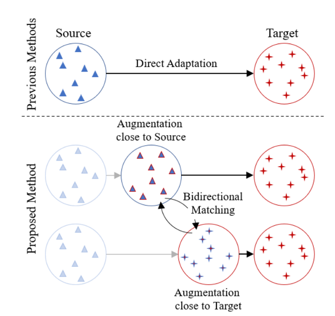
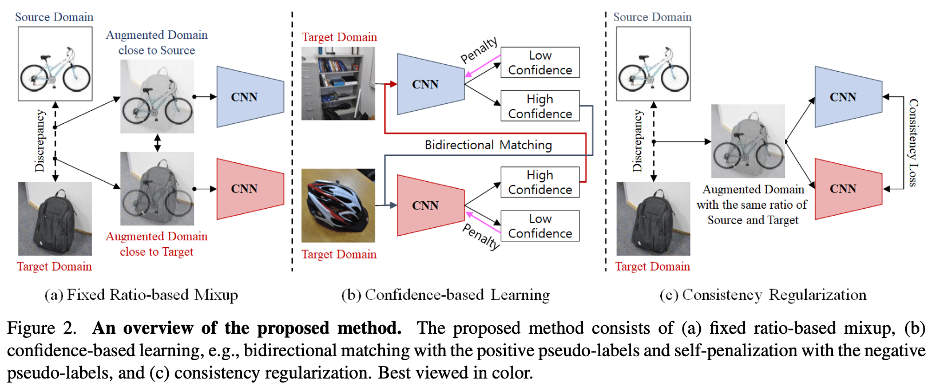

# Fixbi

FixBi: Bridging Domain Spaces for Unsupervised Domain Adaptation [ CVPR 2021  ·  Jaemin Na, Heechul Jung, Hyung Jin Chang, Wonjun Hwang ]

논문링크: https://paperswithcode.com/paper/fixbi-bridging-domain-spaces-for-unsupervised

## Abstract

    

 

- 기존 DANN 등의 모델은 Source에서 Target으로 Direct Adaptation하고자 하였으나, 해당 논문에서는 이러한 Direct Adaptation의 어려움을 인지했다.
- 해당 논문에서는 이러한 문제점의 해결을 위해 Fixed ratio의 Mixup Data Augmentation을 통해 Source와 가까운 Domain과 Target과 가까운 Domain을 형성하여 Adaptation하고자 하였다.

## Architecture

    

 

- 위와 같이 Fixbi에서는 먼저 Source에 가까운 이미지와 Target에 가까운 이미지를 통해 각각의 CNN을 학습시킨다. (이때, Target의 경우 Pseudo label을 만들어서 학습)
- 이후 Target 이미지를 CNN에 넣고 high confidence를 가질 경우 다른 CNN의 Input으로 활용되어 학습이 계속되도록 하고, 아닐 경우에는 penalty를 부여하여 CNN이 반대 방향으로 학습이 되도록 한다.
- High confidence를 가진다는 것은 pseudo label이 정확하다는 것을 의미하기에 위의 동작을 통해 모델이 점차 Target Domain에 적응할 수 있게 된다.
- 이후 1:1 로  Augmented된 데이터가 각 CNN을 통과하면, 동일한 데이터이기에 각 CNN은 유사한 classifier vector를 산출해야 할 것인데, 그렇지 않을 경우에는 해당 CNN들이 과적합 될 위험이 있기에 이를 방지하고자 일종의 Regularization으로써 해당 loss를 산출하여 CNN을 학습한다.